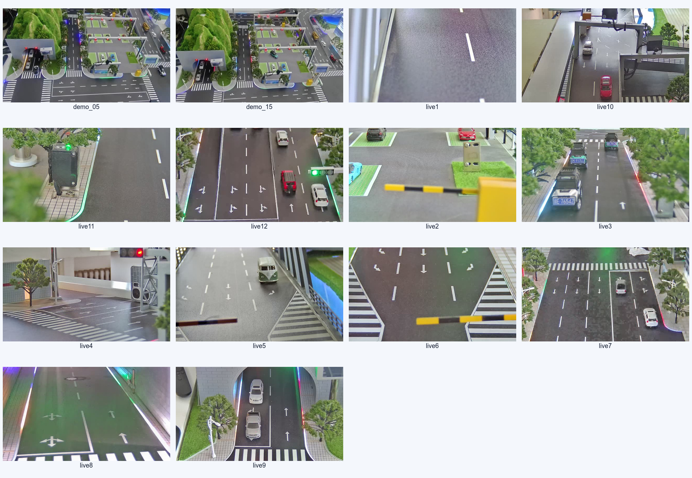

# STrans 智慧交通视觉感知系统测试报告

## 1. 文档控制

| 项目 | 内容 |
|---|---|
| 文档名称 | STrans 智慧交通视觉感知系统测试报告 |
| 文档版本 | V2.0（正式结题版） |
| 执行与编制日期 | 2026-07-14 |
| 被测分支 | `LING` |
| 代码基线 | `b0f3be2`（已同步 `origin/LING`；测试、修复与结题材料位于当前工作区） |
| 测试阶段 | 结题前系统验证与回归测试 |
| 测试负责人 | 项目组 |
| 总体结论 | **结题演示范围有条件通过；生产级验收暂不准出** |

本报告区分“测试执行通过率”“需求覆盖程度”和“产品准出结论”。本轮已执行的 107 个自动化测试/脚本单元全部通过，但这不代表需求覆盖率、算法准确率或生产就绪度达到 100%。

## 2. 测试目标与依据

### 2.1 测试目标

1. 验证视频接入、视觉识别、道路分析、业务处置和数据归档主流程可以贯通；
2. 验证车辆与车牌感知、道路异常、道路空间逻辑、热力图、自适应调度等核心模块的确定性行为；
3. 验证身份认证、角色权限、白名单、摄像头管理、历史与告警等业务功能；
4. 验证道路建模辅助工具已完整纳入项目，页面、模型契约和本机桥接具备可交付性；
5. 使用真实沙盘录像验证 CUDA 推理、前端实时流展示和识别结果持久化闭环；
6. 识别影响结题演示、后续部署和算法精度的缺陷与风险，为复测和迭代提供基线。

### 2.2 测试依据

| 依据 | 用途 |
|---|---|
| `软件工程实训II-包老师.pdf` | 项目初始任务、过程与交付要求 |
| `05-系统测试计划.md` | 测试范围、分层策略、用例优先级和准入/准出标准 |
| `01-功能模块总览.md` 及 M01—M13 模块文档 | 功能边界、模块职责和主要业务流程 |
| `10-真实数据集识别测试报告.md` | F 盘样本、CUDA 环境、性能数据、识别观察和证据路径 |
| `12-CodeGraph模块验证与PPT索引.md` | 模块结构、调用关系和代码—测试—运行证据映射 |
| 当前仓库源代码、测试代码和 Git 提交历史 | 实际实现、变更范围和回归对象 |

### 2.3 判定原则

- 自动化用例以断言全部满足、进程退出码为 0、无失败和无跳过为通过；
- 构建与编译以命令成功完成且无阻断错误为通过；
- 浏览器系统测试以关键页面可达、主流程可操作、权限显示符合角色、控制台无未处理错误为通过；
- 真实数据测试以样本成功读取、推理链路完成、结果可展示和可持久化为功能通过；
- 没有人工真值的数据只用于功能与性能验证，不据此计算或宣称 Precision、Recall、F1、OCR 整牌准确率；
- 环境阻塞、未执行项和已知缺陷不得记为通过。

## 3. 测试范围

### 3.1 纳入范围

| 测试域 | 纳入模块与行为 |
|---|---|
| 身份与权限 | 验证码、注册、登录、会话、修改密码、用户禁用、管理员/普通用户可见性、审计 |
| 视频接入 | 摄像头配置、增删改查、状态、启动/停止、本地图片/录像、MJPEG、地址与错误信息脱敏 |
| 车辆与车牌感知 | 检测结果处理、轨迹稳定、车辆框筛选、车牌归一化与关联、白名单决策 |
| 道路异常 | ROI、候选融合、全局运动抑制、合法目标解释、多帧确认及真实视频观察 |
| 道路理解 | 道路几何、车道/路口归属、禁停、拥堵评分、热力图和道路掩膜 |
| 数据闭环 | 分析历史、事件、证据哈希、处置状态、导出和智能报告归档 |
| 模型与资源 | 模型下载边界、自适应调度、CPU/GPU/内存状态、CUDA 推理 |
| 道路建模 | 项目内静态资产、节点组、车道生成、相机姿态、JSON 契约和本机 RTSP 桥接 |
| Web 系统 | 登录、实时监控、功能中心、角色导航、智能报告、两种桌面分辨率和控制台/网络 |
| 工程质量 | Python 编译、前端生产构建、资源释放告警门禁 |

### 3.2 不纳入正式结论的范围

- 未在当前主链路形成完整实现的独立碰撞识别、信号灯识别和完整跨线流量算法；
- 物理闸机和其他外部道路设备的动作执行；
- 外部智能报告服务自身的模型质量，只验证本系统的配置、请求边界、错误处理和归档；
- 公网、校园网或第三方服务不可控故障下的长期稳定性；
- 缺少人工真值时的车辆、车牌和道路异常准确率指标；
- 30—60 分钟长稳、断流恢复、并发压力和完整 FastAPI 权限/错误码矩阵。

## 4. 测试策略与过程

### 4.1 分层策略

| 层级 | 方法 | 本轮目的 |
|---|---|---|
| 静态与工程检查 | Python `compileall`、Vite 生产构建、资产与契约检查 | 排除语法、构建和交付资产缺失问题 |
| 单元测试 | Python `pytest`、Node.js 原生测试 | 验证纯逻辑、边界条件、状态转换和资源释放 |
| 服务/集成测试 | 临时 SQLite、可控替身、道路建模桥接测试 | 验证持久化、服务组合和跨目录契约 |
| 系统测试 | 本地前后端 + Playwright Chromium | 遍历角色、页面、实时监控和管理流程 |
| 真实数据测试 | F 盘固定录像、离线抽帧、实时文件流 | 验证 CUDA 推理、实际画面表现和数据闭环 |
| 人工视觉复核 | 对代表帧、短视频、告警和历史记录交叉检查 | 发现误报、重复事件和分类稳定性问题 |

### 4.2 测试数据与隔离

- 自动化服务测试使用临时目录和临时 SQLite，不写入交付数据库；
- 系统测试数据库为 `output/system-test/backend/data/traffic_analysis.db`；
- 实时识别验证数据库位于 `output/realtime-test/backend/data/traffic_analysis.db`；
- F 盘数据只读使用，所有清单、结构化结果、标注帧和短视频写入仓库 `output/`；
- 模型、网络和外部报告等不稳定边界在单元测试中使用可控替身；真实推理单独使用 CUDA 环境执行。

### 4.3 执行过程

1. 盘点原有测试并执行基线，识别依赖阻塞与覆盖缺口；
2. 补充服务层、前端、道路逻辑、评测工具和道路建模相关测试；
3. 修复测试暴露的资源释放、设备类型契约和自定义视频源可见性问题；
4. 执行主项目与原始道路建模工具全量自动化回归；
5. 执行管理员、普通用户、道路建模页面和两种分辨率的浏览器系统遍历；
6. 使用 F 盘 13 段真实视频执行 65 帧 CUDA 固定抽样，并接入前端实时流；
7. 汇总缺陷、限制、覆盖矩阵和准出结论。

## 5. 测试环境

| 项目 | 实际环境 |
|---|---|
| 操作系统 | Windows 11，10.0.26200，Asia/Shanghai |
| CPU / 内存 | Intel Core i7-14650HX，16 核 24 线程 / 31.71 GB |
| GPU / 显存 | NVIDIA GeForce RTX 4050 Laptop GPU / 6141 MiB，驱动 595.79 |
| 主项目 Python | Python 3.14.3，`C:\Python314\python.exe` |
| 深度学习环境 | PyTorch 2.11.0+cu126，`torch.cuda.is_available() = True`，设备 `cuda:0` |
| 道路建模工具 Python | Anaconda Python 3.13.9；pytest 9.0.2、orjson 3.11.7、Pillow 12.1.1、Shapely 2.1.2 |
| Node.js / npm | Node.js 24.14.0 / npm 11.12.1 |
| 浏览器 | Playwright Chromium，1920×1080 与 1366×768 |
| 后端 | `http://127.0.0.1:8000`，专用测试进程 |
| 前端 | `http://127.0.0.1:5173`，Vite 临时测试进程；验证后关闭 |
| 主要模型 | `yolo11s.pt`，本地模型服务 |
| CUDA 固定样本参数 | 置信度 0.25、输入尺寸 640、每段均匀抽取 5 帧 |

项目 `.venv` 中的 Torch 为 CPU 构建，承担轻量单元测试；真实识别与性能数据全部来自上述 CUDA Python 环境。该区分避免将 CPU 环境结果误记为 GPU 结果。

## 6. 测试执行与统计

### 6.1 原始基线

| 类别 | 原有文件/用例 | 执行结果 | 基线评价 |
|---|---:|---|---|
| 后端 Python | 5 个文件，13 项 | 8 通过、5 项因缺少运行依赖而阻塞；无断言失败 | 仅覆盖录像、模型下载、道路掩膜和流信息脱敏 |
| 前端 JavaScript | 1 个文件，6 项 | 6/6 通过 | 仅覆盖热力图纯函数 |
| 工程检查 | Python 编译、前端构建 | 均通过 | 工程可构建 |
| API / 浏览器 / 真实识别 | 0 项 | 未建立 | 主业务闭环证据不足 |

基线结论为：**局部基础测试可用，系统级覆盖不足**。本轮在此基础上增加 62 项主项目测试，使主项目用例由 19 项增至 81 项；同时迁入道路建模算法与测试，并保留 fork 增强后的桥接验证，形成 26 个工具测试/脚本单元。

### 6.2 自动化回归统计

| 测试批次 | 计划 | 通过 | 失败 | 阻塞/跳过 | 通过率 |
|---|---:|---:|---:|---:|---:|
| 主项目后端 Python | 62 | 62 | 0 | 0 | 100% |
| 主项目前端 JavaScript | 19 | 19 | 0 | 0 | 100% |
| **主项目小计** | **81** | **81** | **0** | **0** | **100%** |
| 道路建模工具 Python（含桥接 6 项） | 21 | 21 | 0 | 0 | 100% |
| 道路建模工具 Node 脚本组 | 5 | 5 | 0 | 0 | 100% |
| **道路建模工具小计** | **26** | **26** | **0** | **0** | **100%** |
| **全部自动化测试/脚本单元** | **107** | **107** | **0** | **0** | **100%** |

统计口径说明：

- “107 个测试单元”由“主项目 81 项 + 道路建模工具 26 项”构成；
- 主项目 81 项由后端 62 项与前端 19 项构成；道路建模 Python 21 项中包含桥接 6 项，不能再次累加；
- 浏览器 17 个检查点、65 帧真实样本、编译和构建属于不同验证维度，不计入自动化 107 项；
- 通过率只反映已执行测试单元结果，不代表功能需求覆盖率或算法准确率为 100%。

### 6.3 工程与系统验证统计

| 验证项 | 结果 | 判定 |
|---|---|---|
| Python `compileall` | 后端源码编译成功 | 通过 |
| Vite 生产构建 | 构建成功 | 通过 |
| 后端资源释放门禁 | 在 `ResourceWarning` 视为错误时全量通过 | 通过 |
| 管理员、普通用户及道路建模浏览器遍历 | 17/17 检查点通过 | 通过 |
| ESP 方案退役后前端复测 | 管理员登录、功能中心、趋势页、摄像头新增/删除、道路建模入口均通过；摄像头类型仅保留自定义、手机、USB 和沙盘 RTSP | 通过 |
| 道路建模页面控制台 | 0 错误、0 警告 | 通过 |
| 两种桌面分辨率 | 1366×768、1920×1080 关键页面可操作 | 通过 |
| 退役复测响应式布局 | 1440×900 桌面与 390×844 手机视口均无横向溢出，主要内容可滚动访问 | 通过 |
| 本机 RTSP 桥接冒烟 | 健康接口、静态首页、FFmpeg 检测正常；测试后端口关闭 | 通过 |
| 真实视频固定抽帧 | 65/65 帧成功读取并完成 CUDA 推理 | 通过 |
| 前端实时文件流 | 启动、推理、展示、历史和告警落库闭环完成 | 通过 |

## 7. 需求与模块覆盖矩阵

| 需求/模块 | 自动化证据 | 系统/数据证据 | 当前覆盖评价 |
|---|---|---|---|
| R01 身份认证与角色权限 | 认证服务 5 项、验证码前端 3 项 | 管理员与普通用户登录，角色导航符合预期 | 基础覆盖充分；独立 API 越权状态码矩阵待补 |
| R02 视频源与摄像头管理 | CameraHub 4 项、流信息脱敏 3 项、前端设备契约 2 项 | 管理页增删改查、F 盘录像启动和实时选择；ESP 退役复测确认最终类型仅为自定义、手机、USB、沙盘 RTSP | 主路径通过；断流重连和异常源恢复待测 |
| R03 车辆检测、跟踪与稳定计数 | 评测/视频工具 9 项，部分道路筛选逻辑测试 | 65 帧 CUDA 抽样、live12 实时流与短视频 | 功能链路通过；检测与跟踪缺少人工真值和更直接的行为测试 |
| R04 车牌识别与白名单 | 白名单 5 项、认证/存储协同测试 | live3 产生 OCR 文本，前端显示复核事件 | 决策逻辑覆盖；OCR 整牌准确率和逐车关联待真值复核 |
| R05 道路异常识别 | 候选相关工具与流程结构证据 | 真实视频发现道路标线误报 | 可运行但质量未准出；完整状态机与真实回归集待补 |
| R06 道路逻辑、禁停与拥堵 | 道路逻辑 6 项、热力图 6 项 | 实时页面显示速度、拥堵和热力数据 | 纯逻辑覆盖良好；真实轨迹和标定精度待测 |
| R07 道路语义掩膜 | 道路掩膜 4 项 | 热力图页面使用道路示意底图 | 局部算法覆盖；真实分割质量未量化 |
| R08 历史、告警、证据与导出 | 分析存储 4 项、智能报告 4 项 | 实时识别结果落库并可回查 | 主闭环通过；事件逐帧重复问题未关闭 |
| R09 自适应调度与资源监控 | 调度策略 6 项 | 页面可达并显示资源信息 | 主要策略分支覆盖；持续负载滞回待长稳验证 |
| R10 道路建模辅助工具 | 前端入口/资产/模型 5 项、工具 Python 21 项（含桥接 6 项）、Node 5 项 | 同源页面加载、Canvas 与工具栏正常，控制台无异常 | 建模、导出契约和本机桥接覆盖充分 |
| R11 Web API | 服务测试及浏览器间接请求 | 主要页面业务请求成功 | 主流程可用；缺少独立 TestClient 成功/未认证/越权/无资源矩阵 |
| R12 前端系统 | 前端 19 项、生产构建 | 17 个原有浏览器检查点；另以 1440×900 与 390×844 完成 ESP 退役复测 | Chromium 桌面和手机视口主流程通过；更广浏览器兼容未测 |
| R13 工程可维护性 | 编译、构建、资源释放门禁 | CodeGraph 结构验证 | 基础工程质量满足结题；前端大组件和同名历史类仍有重构空间 |

覆盖结论：主要功能模块均至少具备代码结构、自动化、浏览器或真实数据证据之一，功能链路完整性满足结题展示要求；API 契约、算法真值、异常状态机、断流与长稳仍是覆盖缺口。

## 8. 真实数据与 GPU 验证

### 8.1 数据集与用例

本轮只读盘点并使用 `F:\datasets`、`F:\STrans_recordings` 和 `F:\STrans_exports` 中的真实沙盘资料。正式固定样本覆盖 12 路 `live1`—`live12` 录像及 1 段综合演示视频，共 13 段视频、65 个等距抽样帧；另使用 live12 和 live3 生成多车、车牌代表性短视频，并将 live12 录像接入前端实时流。

*图 8-1 真实沙盘数据集机位总览。拼图展示综合演示画面及 live1—live12 的代表视角，覆盖路口、直道、隧道、停车区、近景车牌、多车和无车道路等差异化场景。*

该总览用于说明测试样本并非单一机位重复抽帧，而是包含视角、目标尺度、遮挡和背景复杂度差异。各机位的固定抽样规则保持一致，便于后续在相同输入上复算结果和执行版本回归。

| 用例 | 结果 |
|---|---|
| 13 段视频固定抽帧 | 65/65 成功 |
| 无车/少车负样本 | 5 个机位未产生车辆框，可作为本轮负样本基线 |
| 多车场景 | live10、live12、live7、live9 代表帧主要车辆可见并被检测 |
| 近景车牌 | live3 产生多个车牌文本，需人工真值复核 |
| 多车短片 | live12 27—33 秒，24/24 帧均显示 3 辆车 |
| 车牌短片 | live3 87—93 秒，24/24 帧均有检测结果 |
| 前端实时流 | 视频源创建、CUDA 模型流启动、页面展示和历史落库均通过 |
| 浏览器控制台 | 实时识别阶段 0 错误、0 警告 |

*图 8-2 CUDA 固定样本代表结果。橙色/绿色标注展示综合远景、多车、近景车牌和不同道路视角下的系统输出，同时保留无目标或弱目标画面作为对照。*

代表拼图只证明系统能在这些真实画面上完成推理并产生可视化结果，不等同于准确率统计。尤其是远景小目标、细分类和车牌文本仍需结合人工真值逐项复核。

### 8.2 CUDA 固定样本结果

| 指标 | 结果 |
|---|---:|
| 采样/成功读取 | 65 / 65 |
| 有检测结果的帧 | 36（55.38%） |
| 检测目标总数 | 72 |
| 稳定车辆计数合计 | 68 |
| 不同车牌文本 | 5 |
| 事件输出 | 39 |
| 平均推理耗时 | 683.20 ms |
| P50 / P95 | 328.82 / 2856.65 ms |
| 最大耗时 | 4122.53 ms |

相同 65 帧的 CPU 功能预跑平均/P50/P95 分别为 1158.06/783.86/3469.94 ms。CUDA 平均耗时下降约 41.0%，P50 下降约 58.1%；P95 改善较小，主要受首次模型初始化和 CPU 侧车牌 OCR 影响。此结果用于说明当前设备上的相对性能，不外推为其他设备和 Python 环境的保证值。

### 8.3 前端实时流结果

live12 文件流连续运行约 369 秒，测试库记录 210 条分析结果，其中 209 条具有有效耗时：平均 948.13 ms、P50 666.50 ms、P95 3224.13 ms；平均稳定车辆数 3.01。页面显示约 16 FPS 为视频读取速度，而综合分析结果约 0.57 次/秒，两者不可混同。

*图 8-3 前端 live12 实时流验证。页面同时显示车辆框、稳定车辆数、拥堵状态、CPU/GPU/显存、推理耗时、道路示意图和事件日志。*

该截图证明“视频源启动—CUDA 推理—前端展示—交通状态—事件记录”的纵向链路已在真实录像上贯通。画面中的道路异常候选也直观保留了道路箭头误报证据，因此既是通过证据，也是未关闭 S2 缺陷的复现材料。

人工复核确认：多车检测和前端数据闭环可以展示；同时发现道路箭头形成异常候选、同类事件逐帧写入、玩具车细分类不稳定及车牌文本可能重复等问题。由于尚未建立人工标注真值，本报告不输出 Precision、Recall、F1 或 OCR 整牌准确率。

## 9. 缺陷管理

### 9.1 缺陷分级

| 等级 | 定义 | 准出影响 |
|---|---|---|
| S1 阻断 | 系统无法启动、主流程完全中断或数据严重损坏 | 不准出 |
| S2 严重 | 核心功能错误、告警或数据可信度明显受损，且无完整绕过方案 | 生产级不准出；结题演示须明确边界 |
| S3 一般 | 局部功能或兼容性错误，存在合理绕过，不阻断主流程 | 修复后回归或带风险接受 |
| S4 建议 | 不影响核心功能的体验、文档或低优先级可维护性问题 | 可纳入后续迭代 |

### 9.2 缺陷清单

| ID | 等级 | 现象与影响 | 处置状态 | 回归/建议 |
|---|---|---|---|---|
| BUG-001 | S2 | SQLite 连接未及时关闭，可能积累文件句柄并影响临时库清理 | **已修复**：统一连接生命周期并替换 6 个持久化服务入口 | 后端全量测试在 `ResourceWarning` 作为错误时通过 |
| BUG-002 | S3 | 前端设备类型清单与后端实际支持契约不一致，可能误导配置 | **已修复**：统一支持类型常量并增加前端回归 | 单测与浏览器表单复查通过 |
| BUG-003 | S3 | 第 13 路自定义录像源在管理页存在，但实时监控选择器不可见 | **已修复**：取消固定截断 | 前端 19/19 通过，实际选择并启动 `custom1` |
| BUG-004 | S2 | 道路箭头持续形成道路异常候选，降低告警可信度 | **未修复** | 增加道路标线抑制、背景稳定、多帧确认与真实视频回归 |
| BUG-005 | S2 | `road_obstacle` 与 `plate_review` 各逐帧写入 208 次，历史与告警产生噪声 | **未修复** | 按相机+类型+区域增加冷却、合并和事件生命周期 |
| BUG-006 | S2 | 道路建模功能入口和外部工具资产未完整纳入仓库，换机后无法交付 | **已修复**：核心静态文件、入口和桥接均纳入项目 | 资产、契约、桥接测试通过；页面 0 错误、0 警告 |

缺陷统计：共记录 6 项，其中 S2 4 项、S3 2 项；已关闭 4 项，未关闭 2 项，均为 S2。当前无 S1 阻断缺陷。

## 10. 准出评估

### 10.1 准出标准核对

| 准出条件 | 结果 | 证据/说明 |
|---|---|---|
| P0 自动化测试全部通过 | 满足 | 主项目 81/81；道路建模工具 26/26 |
| P0 系统主流程通过或有明确环境阻塞说明 | 满足 | 登录—视频—推理—展示—历史/告警链路完成 |
| P1 无未处理严重缺陷 | **不满足** | 道路标线误报和事件洪泛两个 S2 未关闭 |
| 浏览器控制台无未处理异常 | 满足 | 关键页面及道路建模页 0 错误、0 警告 |
| ESP 方案未残留在最终前端流程 | 满足 | 摄像头类型无 ESP 选项；隔离数据库新增/删除网络摄像头成功；复测会话 534 个响应均为 2xx |
| 编译、构建和资源释放检查通过 | 满足 | `compileall`、Vite build、`ResourceWarning` 门禁均通过 |
| 失败、跳过和未执行项有原因及影响说明 | 满足 | 本报告第 3、9、11 节记录 |
| 测试证据可追溯 | 满足 | 结构化结果、数据库、截图、短视频和模块索引均已保存 |

### 10.2 准出结论

**结题演示与结题材料范围：有条件通过。** 系统主要功能模块均有实现与验证证据，自动化回归、工程检查、浏览器遍历、真实视频 CUDA 推理和数据闭环均可支撑答辩演示。演示与报告必须同时披露算法适用场景、真实视频误报、事件去重缺口和准确率尚未量化的边界。

**生产级部署与最终质量验收：暂不准出。** 两项未关闭 S2 缺陷直接影响告警可信度和数据可用性，且 API 权限矩阵、断流恢复和长稳测试尚未完成。完成第 11 节 P0 复测项并回归后，方可重新申请生产级准出。

## 11. 限制与复测建议

### 11.1 当前限制

1. 真实视频没有逐帧车辆框、轨迹、车牌文本和异常事件真值，不能计算精度类指标；
2. `LocalModelService`、道路异常完整状态机、车辆框去重和车牌关联缺少更直接的行为级测试；
3. FastAPI 主要接口缺少成功、未认证、越权、参数错误和资源不存在的独立状态码矩阵；
4. 未执行断流恢复、模型服务异常降级、并发压力和 30—60 分钟长稳测试；
5. 当前性能结果来自单台 RTX 4050 Laptop GPU 和特定 Python/PyTorch 环境，不能直接代表其他设备；
6. 页面短时遍历观察到较多轮询请求，需在长时间运行中评估不可见页面轮询、后端负载和资源增长。

### 11.2 复测优先级

| 优先级 | 复测任务 | 完成标准 |
|---|---|---|
| P0 | 修复道路标线误报并建立真实视频回归集 | 代表道路箭头片段不再产生持续告警，正常异物样本仍能确认 |
| P0 | 增加事件冷却、区域合并和生命周期 | 持续同一事件只形成一个可更新业务事件，历史无逐帧洪泛 |
| P0 | 回归主项目 81 项、道路建模工具 26 项及真实视频主链路 | 107 个测试单元全部通过，实时识别闭环无新增 S1/S2 |
| P1 | 建立车辆、车牌、道路异常人工真值 | 可复算 Precision、Recall、F1、OCR 整牌准确率和事件首次确认时间 |
| P1 | 补 FastAPI 权限与错误码矩阵 | 管理员/普通用户/未登录在关键接口上的状态码和响应契约均被自动验证 |
| P1 | 补断流恢复与异常降级 | 视频断开后状态明确、可重连；外部服务失败不破坏本地主链路 |
| P1 | 执行 30—60 分钟长稳测试 | 无崩溃、句柄泄漏和持续资源增长，轮询频率与后端负载有记录 |
| P2 | 在目标交付设备和统一 Python 环境重测性能 | 给出目标设备 FPS、P50/P95、CPU/GPU/显存基线及环境信息 |

## 12. 证据与追溯

| 证据类型 | 路径/说明 |
|---|---|
| 系统浏览器证据 | `output/playwright/system-test/` |
| ESP 退役复测证据 | `output/playwright/esp-retirement/`（隔离数据库、日志、桌面/手机及道路建模截图） |
| 道路建模页面截图 | `docs/结题材料/assets/road-modeler-page.png` |
| CUDA 固定样本清单 | `output/dataset-evaluation/run-2026-07-14-gpu/manifest.json` |
| 固定样本逐帧结果 | `output/dataset-evaluation/run-2026-07-14-gpu/frame_results.csv`、`frame_results.jsonl` |
| 实时识别测试库 | `output/realtime-test/backend/data/traffic_analysis.db` |
| 真实数据详细报告 | `10-真实数据集识别测试报告.md` |
| 模块、结构与 PPT 索引 | `12-CodeGraph模块验证与PPT索引.md` |

## 13. 最终结论

本轮测试从原有 19 项局部用例扩展为主项目 81 项，并迁入道路建模算法与增强桥接验证 26 个测试/脚本单元，形成 **107/107 自动化测试单元通过**的回归基线；同时完成编译与构建、17 个浏览器检查点、65 帧真实视频 CUDA 推理和前端实时流闭环验证。ESP 方案退役后又以隔离数据库执行一次 Playwright 实测，确认管理员登录、功能中心、趋势页、摄像头新增/删除、道路建模入口及桌面/手机响应式布局均可用，清洁会话控制台 0 错误、0 警告，534 个响应无非 2xx。结果证明 STrans 的视频接入、识别、道路分析、管理、道路建模和数据归档主链路已具备结题展示条件。

测试也证明系统仍存在明确质量边界：道路标线误报和事件逐帧重复入库两项 S2 缺陷尚未关闭，算法准确率缺少人工真值，API 权限矩阵、断流恢复与长稳测试尚未完成。因此正式判定为“结题演示有条件通过，生产级验收暂不准出”。后续应优先关闭两项 S2 缺陷，再按人工真值、接口权限、恢复性和长稳顺序复测。
