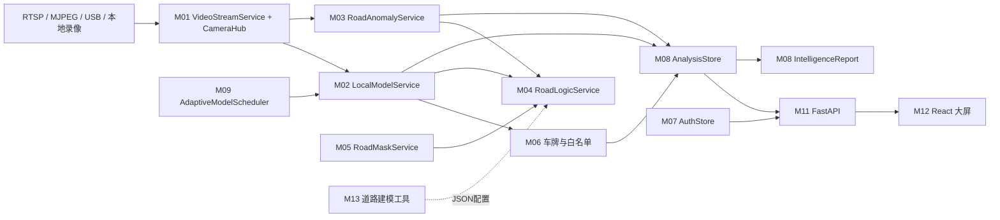
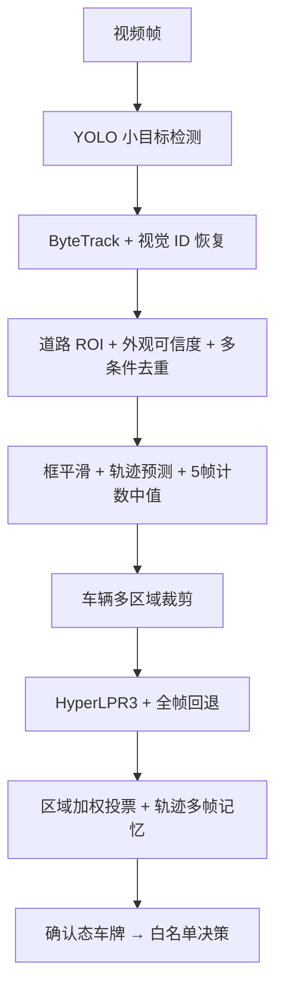
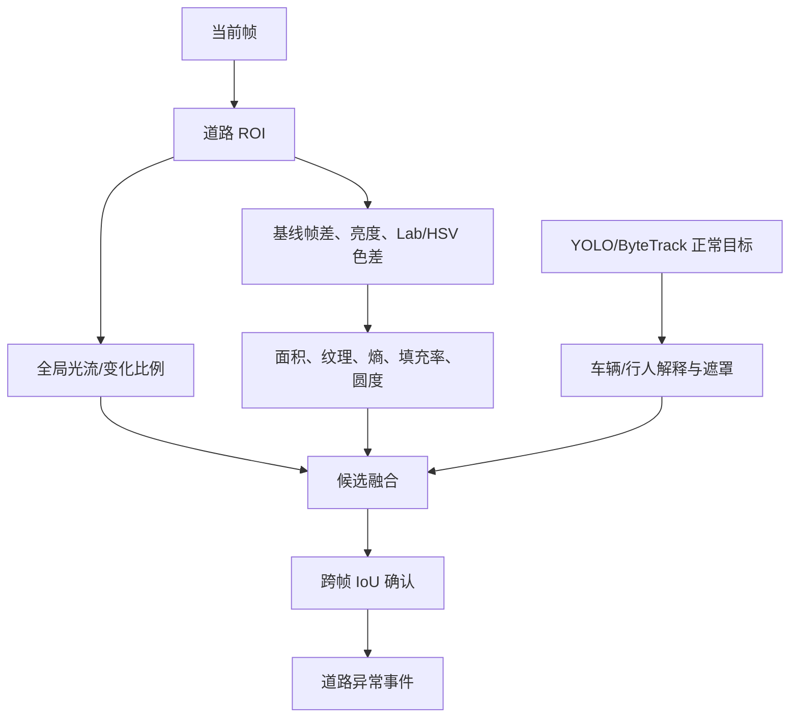
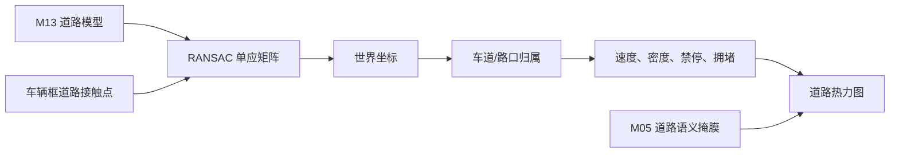

# CodeGraph 模块验证与 PPT 索引

## 1. 验证基线

2026-07-14 在同步 `origin/LING` 至 `b0f3be2`、补齐道路建模静态文件和前端测试后执行全量重建：

```powershell
codegraph index --force .
codegraph status .
```

重建结果：

| 指标 | 数值 |
|---|---:|
| 扫描文件 | 109 |
| 代码文件节点 | 70 |
| 符号节点 | 1,172 |
| 关系边 | 2,370 |
| Python 文件 | 52 |
| JavaScript 文件 | 13 |
| JSX 文件 | 1 |
| YAML 文件 | 39 |

状态为 `Index is up to date`。验证采用 CodeGraph 上下文、跨模块探索、具体符号搜索、自动化测试、浏览器和真实视频证据交叉确认，避免仅凭文件名推断功能。

## 2. 总体调用关系



## 3. 分模块验证索引

| 模块文档 | CodeGraph 入口/关键符号 | 经验证的主要流程 | 自动化/运行证据 | PPT 一句话 |
|---|---|---|---|---|
| [M01-视频接入层.md](M01-视频接入层.md) | `VideoStreamService`、`CameraHub` | 视频源配置 → 线程读取 → JPEG 缓存 → 状态/MJPEG；自定义源持久化 | CameraHub 4 项、脱敏 3 项、真实录像启停 | 多源视频被统一抽象为可管理、可重连的摄像头服务 |
| [M02-车辆感知引擎.md](M02-车辆感知引擎.md) | `LocalModelService` | 模型选择 → CUDA/CPU → YOLO → ByteTrack → 去重/平滑 → 车牌/速度 | F 盘 65 帧 CUDA、实时流、评测/视频脚本 9 项 | 从单帧框升级为带轨迹、车牌和速度的稳定车辆状态 |
| [M03-道路异常识别.md](M03-道路异常识别.md) | `RoadAnomalyService` | 道路 ROI → 帧差/颜色候选 → 相机运动抑制 → 正常目标解释 → 多帧确认 | CodeGraph 找到 ROI、全局运动、基线更新；真实视频发现箭头误报 | 多证据融合提高可解释性，但道路标线仍是迭代重点 |
| [M04-道路逻辑与热力图.md](M04-道路逻辑与热力图.md) | `RoadLogicService` | 标定点 → RANSAC 单应性 → 世界坐标 → 车道/路口 → 拥堵/禁停/热力 | 道路逻辑 6 项、热力图 6 项 | 将视觉检测转换成具有道路空间含义的交通状态 |
| [M05-道路语义分割.md](M05-道路语义分割.md) | `RoadMaskService`、`road_class_ids` | SegFormer → road 类别 → 二值掩膜 → 道路示意底图 → 热点约束 | 道路掩膜 4 项、模型缺失下载回归 | 移动视角热力图只覆盖可行驶道路区域 |
| [M06-白名单与车牌决策.md](M06-白名单与车牌决策.md) | `WhitelistStore`、LocalModel 车牌记忆 | OCR → 规范化/多帧确认 → 模糊匹配 → 放行/复核 | 白名单 5 项、真实 OCR 示例 | 车牌结果与车辆轨迹绑定，稳定后才进入通行决策 |
| [M07-认证与权限.md](M07-认证与权限.md) | `AuthStore` | PBKDF2 → 登录/会话 → 角色依赖 → 改密/禁用 → 审计 | 服务层 5 项、验证码前端 3 项、双角色浏览器 | 管理操作具备身份、角色和审计闭环 |
| [M08-数据闭环.md](M08-数据闭环.md) | `AnalysisStore`、`IntelligenceReportService` | 分析结果 → SQLite → 事件证据/哈希 → 处置/导出 → 报告 | 存储 4 项、报告 4 项、实时库回查 | 识别结果可查询、可复核、可处置、可形成报告 |
| [M09-自适应调度与系统监控.md](M09-自适应调度与系统监控.md) | `AdaptiveModelScheduler.choose` | 任务/资源/时延 → profile → 模型/尺寸/阈值/间隔 → 滞回记录 | 调度 6 项，CodeGraph 确认全局单例与策略入口 | 根据设备负载在精度、实时性和保护模式间动态平衡 |
| [M10-算法客户端与辅助服务.md](M10-算法客户端与辅助服务.md) | `AlgorithmClient`、`WeatherService`、`open_sqlite` | 外部/本地能力封装 → 超时/降级 → 统一资源释放 | SQLite `ResourceWarning` 门禁、工程构建 | 辅助服务通过超时、降级和资源管理保证主链路稳定 |
| [M11-Web_API层.md](M11-Web_API层.md) | `backend/app/main.py` FastAPI app | 权限依赖 → 摄像头/分析/道路/管理路由 → 前端 JSON/MJPEG | 浏览器主要请求成功；独立 TestClient 权限矩阵待补 | API 层把算法、设备和管理能力组合为统一业务接口 |
| [M12-前端架构.md](M12-前端架构.md) | `App`、`roadModelerLinkAttributes`、热力图纯函数 | 登录 → 轮询/流显示 → 识别展示 → 功能中心 → 管理闭环 | 前端 19/19、Vite build、主页面遍历 | 一套 React 大屏同时承载实时识别、交通态势和管理操作 |
| [M13-道路建模辅助工具.md](M13-道路建模辅助工具.md) | 静态 `geometry/model/renderer/app`、`roadModeler.js`、本机桥接 `server.py` | 节点组/车道/摄像头 → 规范化 → 派生逻辑 → JSON 导出；可选 RTSP 截帧 | 前端 5 项、工具 Python 21 项（含桥接 6 项）、Node 5 项、Playwright 0 错误 | 可视化生产道路拓扑和摄像头标定，为空间算法提供配置 |

## 4. 主要算法流程验证

### 4.1 车辆与车牌



### 4.2 道路异常



### 4.3 道路空间与热力图



## 5. CodeGraph 发现与限制

1. 当前代码同时存在 `backend/app/services/auth.py` 和 `auth_store.py` 中同名 `AuthStore`，结构查询会出现同名结果；运行主链路以 `auth_store.py` 为准，后续可清理历史实现降低维护歧义。
2. `main.jsx` 约 2384 行，CodeGraph 能定位 `App` 和主要辅助函数，但组件高度集中；后续可按监控、认证、管理中心拆分。
3. 道路建模脚本使用 IIFE 和 `window.RoadLogicModeler` 全局命名空间，CodeGraph 能索引文件，却未返回 `createModel`、`exportPayload` 等内部符号；本轮用 VM 单测和 Playwright 弥补结构索引盲区。
4. CodeGraph 证明“符号和调用关系存在”，不能证明运行正确或识别准确；因此最终结论必须同时引用自动化、浏览器和真实视频结果。

## 6. PPT 使用方式

- 架构页：使用第 2 节总体调用关系；
- 功能页：从第 3 节每个模块选一句话，配对应 M 文档截图或流程；
- 算法页：使用第 4 节三张流程图；
- 测试页：引用 81/81 主项目、21/21 建模 Python、5/5 建模 Node、浏览器 0 错误和 F 盘 CUDA 数据；
- 局限页：如实展示道路箭头误报、事件洪泛、API 权限矩阵和长稳测试待补。
