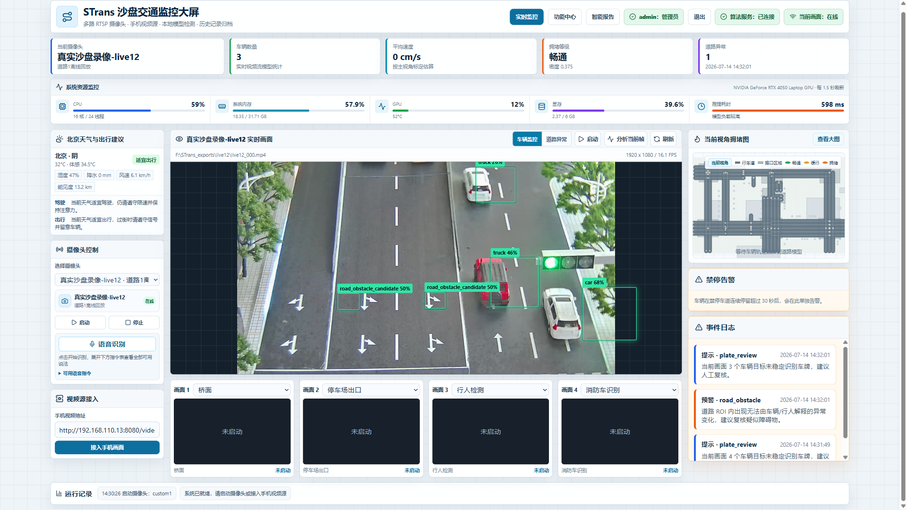
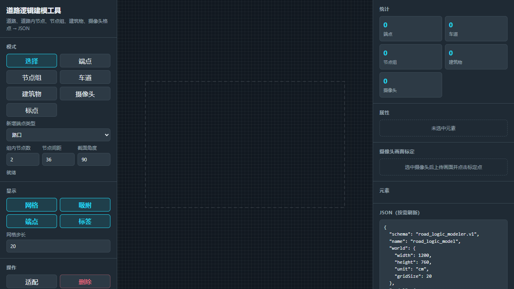

# STrans 软件使用说明书

## 1. 文档信息

| 项目 | 内容 |
|---|---|
| 软件名称 | STrans 智慧交通视觉感知与管理系统 |
| 文档版本 | V1.0 |
| 编制日期 | 2026-07-14 |
| 适用对象 | 系统管理员、普通用户、算法工程人员、部署与维护人员 |
| 适用范围 | 当前 `LING` 分支及结题交付工作区 |
| 配套文档 | `09-系统设计说明书.md`、`06-系统测试报告.md`、`10-真实数据集识别测试报告.md`、M01–M13 模块说明 |

本说明书用于指导 STrans 的安装、启动、日常操作、数据管理、道路建模和故障处置。文中只描述当前仓库已经具备的能力；物理闸机、独立碰撞识别、信号灯识别和完整跨线流量统计不属于当前交付范围。

## 2. 软件概述

STrans 面向智慧交通沙盘场景，将 RTSP/MJPEG 网络流、手机或 USB 摄像头、本地图片和本地录像统一接入计算机端，在本地完成车辆检测与跟踪、车牌识别、白名单判断、道路异常候选检测、道路语义分割和道路空间映射，再通过 React Web 大屏展示实时画面、交通状态和告警。

系统的业务主线为：

> 视频采集 → 模型识别 → 道路分析 → 告警处置 → 历史与证据归档

主要组成如下：

| 层次 | 主要组件 | 用途 |
|---|---|---|
| 展示层 | React、Vite、HTML5 Canvas | 登录、实时监控、热力图、功能中心、道路建模入口 |
| API 层 | FastAPI | 认证、摄像头、识别、历史、告警、报告和管理接口 |
| 视频接入 | CameraHub、VideoStreamService | 多路视频配置、启停、解码、重连和 MJPEG 输出 |
| 视觉感知 | LocalModelService、RoadAnomalyService、RoadMaskService | YOLO/ByteTrack、HyperLPR3、异常候选、SegFormer 道路分割 |
| 交通分析 | RoadLogicService、AdaptiveModelScheduler | 单应映射、车道/路口归属、拥堵、禁停和资源自适应 |
| 数据服务 | AnalysisStore、WhitelistStore、AuthStore | SQLite 历史、告警、证据、白名单、账号和审计 |
| 辅助工具 | 道路建模工具、智能报告服务 | 道路拓扑与标定 JSON 生产、监测报告生成与归档 |

## 3. 运行环境

### 3.1 已验证环境

| 项目 | 已验证配置 |
|---|---|
| 操作系统 | Windows 11，64 位 |
| 主项目 Python | Python 3.14.3 |
| PyTorch / CUDA | PyTorch 2.11.0+cu126，CUDA 可用 |
| GPU | NVIDIA GeForce RTX 4050 Laptop GPU，6141 MiB 显存 |
| CPU / 内存 | Intel Core i7-14650HX，16 核 24 线程 / 31.71 GB |
| Node.js / npm | Node.js 24.14.0 / npm 11.12.1 |
| 前端浏览器 | Chromium 内核浏览器；已验证 1366×768 和 1920×1080 |
| 后端默认地址 | `http://127.0.0.1:8000` |
| 前端默认地址 | `http://127.0.0.1:5173` |
| 本地数据库 | SQLite，默认由后端服务管理 |

### 3.2 推荐配置

- 正式识别演示建议使用支持 CUDA 的 NVIDIA GPU，显存不低于 6 GB；
- 内存建议 16 GB 以上，并为模型权重和视频缓存保留足够磁盘空间；
- 浏览器建议使用当前版本 Chrome、Edge 或 Playwright Chromium；
- 本地录像和图片路径应使用当前 Windows 用户可读的绝对路径；
- 多路实时视频应优先使用稳定的有线网络，并确保 RTSP/MJPEG 地址从运行主机可访问。

### 3.3 GPU、CPU 与 Python 环境说明

系统支持 CUDA 优先、CPU 降级。当前项目 `.venv` 中的 Torch 为 CPU 构建，可用于单元测试和基本功能检查；结题阶段的 65 帧离线评测与前端实时识别均使用 `C:\Python314\python.exe` 的 CUDA 环境。

同一批 65 帧样本中，CUDA 平均推理耗时为 683.20 ms，CPU 功能预跑为 1158.06 ms，平均耗时下降约 41.0%。该结果反映当前设备和软件组合下的运行速度，不等同于识别精度提升。更换 GPU、Python、PyTorch、CUDA、模型权重或摄像头后，模型兼容性、时延和少量数值结果可能变化，应重新记录环境并执行回归测试。

## 4. 安装与部署

### 4.1 部署前检查

1. 确认仓库位于可读写目录，路径中不存在受限权限；
2. 确认 Python、Node.js、包管理器、FFmpeg 和 GPU 驱动可用；
3. 确认端口 8000、5173 未被其他进程占用；
4. 确认模型权重、本地视频和 SQLite 数据目录有足够空间；
5. 正式环境应先设置管理员密码和外部服务密钥，不使用演示配置作为生产配置。

### 4.2 后端安装

在仓库根目录执行：

```powershell
cd backend
python -m pip install -r requirements.txt
```

若只执行轻量单元测试，可使用项目已有的 CPU 虚拟环境；若要运行正式视觉识别，应确保当前 Python 中 `torch.cuda.is_available()` 返回 `True`，且 PyTorch CUDA 版本与显卡驱动兼容。

后端启动命令：

```powershell
cd backend
python -m uvicorn app.main:app --host 127.0.0.1 --port 8000
```

启动后先访问 `http://127.0.0.1:8000/api/health` 检查服务状态。模型采用按需加载方式，第一次识别通常包含权重加载和 CUDA 预热开销。

### 4.3 前端安装与启动

```powershell
cd frontend
pnpm install --frozen-lockfile
pnpm dev -- --host 0.0.0.0
```

浏览器访问 `http://127.0.0.1:5173`。Vite 默认将 API 指向 `http://localhost:8000`；如果后端地址不同，应通过前端环境配置调整 `VITE_API_BASE`。

生产构建命令：

```powershell
cd frontend
pnpm build
```

构建结果位于 `frontend/dist/`，其中包含道路建模静态页面 `dist/road_logic_modeler/`。

### 4.4 模型与可选服务

- 车辆模型、车牌模型和道路分割模型在本地运行；缺失模型可按现有下载逻辑准备，正式演示前应提前下载并完成一次预热；
- SegFormer 道路分割模型位于 `data/models/segformer-b0-cityscapes/`，首次准备需要网络和足够磁盘空间；
- 智能报告需要管理员配置兼容的 DeepSeek API 地址、模型和密钥。未配置或外部服务不可用时，核心识别链路不受影响；
- 远程算法服务是可选能力，未启用时系统使用本地模型；
- 道路建模的 RTSP 单帧桥接为本机可选工具，仅监听 `127.0.0.1:8765`，依赖 FFmpeg。离线节点、车道、建筑和摄像头建模不依赖该桥接。

## 5. 用户角色与权限

| 功能 | 普通用户 | 管理员 |
|---|:---:|:---:|
| 登录、退出、修改本人密码 | √ | √ |
| 查看和启动摄像头 | √ | √ |
| 查看实时识别、热力图、历史、告警和报告 | √ | √ |
| 处置告警、下载证据 | √ | √ |
| 查看白名单 | √ | √ |
| 新增、修改、删除摄像头 | — | √ |
| 修改白名单 | — | √ |
| 模型配置、自适应调度 | — | √ |
| 用户管理、密码重置、审计日志 | — | √ |
| 智能报告服务配置与报告生成 | — | √ |
| 道路建模入口 | — | √ |

登录和注册需要图片验证码。验证码有效期为 5 分钟；前端在请求失败时按 1 秒、2 秒和 4 秒退避重试。首次建库前必须通过 `STRANS_ADMIN_PASSWORD` 设置至少 12 位的管理员初始密码，登录页不会预填密码；已有数据库升级不受影响。

## 6. 基本操作

### 6.1 登录与退出

1. 打开前端地址；
2. 输入用户名、密码和图片验证码；
3. 登录成功后进入实时监控页；
4. 使用顶部用户菜单修改密码或退出；
5. 修改密码后按页面提示重新登录。

如果验证码未显示，应先检查后端健康状态和浏览器网络请求。不要连续刷新页面绕过错误，应等待自动退避结束并查看最后错误提示。

### 6.2 添加和测试视频源（管理员）

1. 打开“功能中心 → 摄像头管理”；
2. 选择类型：自定义、手机、USB 或沙盘 RTSP；
3. 填写名称、视频地址或本地文件路径、位置说明和热力图模式；
4. 保存后执行连通性测试；
5. 测试通过后返回实时监控选择该摄像头并启动；
6. 如需停止，使用单路停止或管理员批量停止。

视频地址在日志、状态和审计中会被脱敏。预置沙盘源受保护，不能按普通自定义源删除。静态图片会被识别为静态源，本地录像播放结束后按视频接入策略循环。

ESP32-CAM 采集方案已整体退役，不属于最终安装、配置或验收范围。请勿使用历史 V1 文档中的 ESP32-CAM 烧录和接入步骤；最终视频源以本节列出的自定义 RTSP/MJPEG、手机、USB、沙盘 RTSP 和本地媒体能力为准。

### 6.3 车辆监控模式

1. 在顶部选择摄像头；
2. 将任务模式切换为“车辆监控”；
3. 启动视频源，确认原始画面和模型标注画面同时显示；
4. 查看车辆框、跟踪 ID、车牌、白名单状态、速度、车辆数、密度和拥堵等级；
5. 查看底部 CPU、内存、GPU、显存和推理耗时；
6. 需要时切换热力图为关闭、画面叠加或道路示意模式。



*图 6-1 前端实时监控操作界面。中央为模型标注视频，顶部为车辆、速度、拥堵和异常摘要，左侧用于视频源启停，右侧显示道路示意和事件日志。*

操作时先确认顶部“算法服务已连接”和摄像头“在线”，再观察资源监控与推理耗时是否持续稳定。截图中的道路异常候选属于需要人工复核的输出，不能仅凭候选框直接认定道路存在真实异物。

车辆监控结果经过 YOLO、ByteTrack、道路 ROI、外观过滤、轨迹稳定、HyperLPR3 和白名单决策联合生成。车牌和速度在远景、遮挡或未充分标定的摄像头上可能波动，应结合连续帧和历史记录判断。

### 6.4 道路异常模式

1. 选择固定、画面稳定的摄像头；
2. 将任务模式切换为“道路异常”；
3. 等待背景和多帧候选状态建立；
4. 查看道路异物、道路行人和可选道路破损候选；
5. 发现告警后进入“告警处置”进行确认、解决或标记误报；
6. 如摄像头位置、光照或场景发生明显改变，应停止并重新启动任务，必要时重置异常背景状态。

道路异常输出定义为“候选检测 + 人工复核”。移动画面、剧烈光照、阴影、反光和道路箭头仍可能触发候选，不应将候选直接等同于真实事故或异物。

### 6.5 热力图与道路状态

- 已标定固定视角：车辆框底边中心通过单应矩阵映射到道路世界坐标，再计算车道、路口、禁停和拥堵；
- 未标定或移动视角：使用归一化画面热点，并可由 SegFormer 道路掩膜约束热点范围；
- 热力图表示近期活跃轨迹形成的当前状态，不是无限累计的历史轨迹图；
- 非参考摄像头的速度属于估计值，不能作为法定测速数据。

## 7. 管理与数据闭环

### 7.1 白名单管理

管理员可新增、更新和删除白名单车牌；普通用户可查看列表。车牌先做规范化和模糊匹配，再形成 `allow/deny` 软件决策。该决策用于页面显示和事件记录，当前系统没有驱动物理闸机。

白名单变更后，相关车辆的短时决策缓存会被清理。正式演示前应检查白名单内容、启用状态和 OCR 识别文本是否一致。

### 7.2 历史记录

“历史记录”支持按摄像头查询，并可导出 CSV 或 JSON。记录包含模型、车辆数、密度、拥堵、检测框、事件和推理耗时等信息。管理员可删除单条或按条件清理，清理前应先备份需要保留的数据。

### 7.3 告警处置与证据

1. 进入“告警处置”；
2. 按状态筛选待处理事件；
3. 查看事件类型、摄像头、时间、描述和证据；
4. 填写处理状态、处理人和备注；
5. 下载证据 ZIP 进行归档。

证据包可包含事件元数据、结构化分析结果、原始帧、标注帧、清单和 SHA-256。哈希用于检查文件完整性，不代表识别结论已经人工确认。

### 7.4 智能报告

管理员先在智能报告配置页填写 API 地址、模型和密钥，再基于当前检测、道路状态、天气和近期历史生成报告；普通用户可查看已归档报告。外部服务失败时应保留原始结构化数据，不能用报告生成状态替代系统识别状态。

### 7.5 自适应调度

管理员可开启或关闭自适应调度。启用后，系统根据任务、静态/实时来源、CPU、内存、GPU、显存和推理耗时，在 quality、balanced、realtime、protect 和 anomaly 档位间选择模型、输入尺寸、阈值和检测间隔；关闭后进入 manual 档，使用人工配置。

资源保护档可能降低尺寸和分析频率以保持系统可用。调度只改变运行参数，不改变车辆、异常和告警的业务定义。

## 8. 道路建模辅助工具

### 8.1 使用目的

道路建模工具用于生产二维道路拓扑、建筑物、摄像头位置和标定关系，为 RoadLogicService 的坐标映射、车道/路口归属、禁停和热力图提供配置。该工具不执行 YOLO、OCR 或异常识别。

### 8.2 操作流程

1. 管理员打开“功能中心 → 道路建模”；
2. 新建模型或导入已有 JSON；
3. 设置世界尺寸、单位和网格；
4. 创建道路节点或节点组；
5. 按节点组连接平行车道，编辑方向、宽度和控制点；
6. 添加建筑物和摄像头；
7. 为摄像头添加画面点与道路实体的标定关系；
8. 执行规范化和派生逻辑生成；
9. 导出 `road_logic_modeler.v1` JSON；
10. 人工审核、版本留存后，再交由后端道路逻辑模块使用。



*图 8-1 道路逻辑建模工具初始界面。左侧选择节点、节点组、车道、建筑物、摄像头和标点工具，中部为带网格的建模画布，右侧展示统计、属性和实时 JSON。*

建模时应先设置世界尺寸与网格，再按照“节点/节点组—车道—建筑物—摄像头—画面标定”的顺序添加对象。右侧 JSON 会随模型刷新，导出前需核对 `schema`、节点引用、车道方向和摄像头标定关系。

### 8.3 发布约束

当前建模工具没有自动写回生产配置，也没有完整的“草稿—审核—发布—回滚”服务端流程。导出 JSON 必须人工检查 schema、世界尺寸、节点引用、车道方向、摄像头标定点和版本记录，不能直接覆盖正在使用的道路模型。

## 9. 数据、备份与证据管理

- 定期备份 SQLite 数据库、道路模型 JSON、模型权重和告警证据目录；
- 导出历史或证据前，记录系统版本、模型、阈值、摄像头和时间范围；
- 真实视频源只读使用，离线评测和截图输出写入 `output/`；
- API 密钥、管理员密码和完整视频地址不得写入答辩截图、日志附件或公开仓库；
- 删除用户、历史、白名单或道路配置前，应先完成备份和审计确认；
- 数据库文件不应由多个独立后端进程同时作为同一交付实例写入。

## 10. 常见异常与处理

| 现象 | 可能原因 | 处理方法 |
|---|---|---|
| 登录页验证码不显示 | 后端未启动、网络阻塞、接口连续失败 | 检查 `/api/health`；等待 1/2/4 秒自动重试；查看浏览器网络错误 |
| 前端可打开但无业务数据 | 后端地址配置错误或会话过期 | 检查 `VITE_API_BASE`、重新登录、确认 8000 端口 |
| 视频源显示离线 | 地址错误、文件不存在、RTSP 网络异常 | 在摄像头管理执行测试；核对路径权限和网络；停止后重新启动 |
| 视频有画面但无标注 | 模型未加载、权重缺失、任务模式错误 | 查看模型健康与后端日志；确认权重；检查 traffic/road_anomaly 模式 |
| GPU 不可用 | 使用 CPU Torch、驱动或 CUDA 版本不匹配 | 在目标 Python 中检查 `torch.cuda.is_available()`；切换已验证 CUDA 环境 |
| 第一次推理明显较慢 | 模型加载、CUDA 预热、OCR 初始化 | 启动后先用固定样本预热，再开始正式演示 |
| 推理延迟持续升高 | OCR 密集、多路并发、显存或内存压力 | 开启自适应调度；降低尺寸/频率；减少同时运行的流 |
| 道路异常频繁误报 | 画面移动、光照变化、箭头/标线或背景未稳定 | 固定摄像头和光照；重置背景；人工标记误报；保留样本用于规则回归 |
| 同类告警数量快速增长 | 实时事件缺少完整业务级冷却和生命周期合并 | 暂停异常流、按事件复核；交付版本中避免长时间无监督运行 |
| 热力图位置不准 | 标定点不足、道路模型不匹配、摄像头位置改变 | 重新标定并审核 JSON；确认摄像头和模型版本对应 |
| 智能报告生成失败 | API 未配置、密钥错误、外部服务不可用 | 检查脱敏配置和网络；保留历史与事件数据，稍后重试 |
| 道路建模 RTSP 截帧不可用 | 本地桥接未启动或 FFmpeg 缺失 | 启动可选桥接并检查 8765；也可上传静态截图继续离线建模 |

## 11. 维护与升级

### 11.1 日常维护

1. 每次演示前检查后端、前端、GPU、模型健康、磁盘空间和摄像头连通性；
2. 使用固定视频执行短回归，核对车辆框、历史写入、告警和热力图；
3. 定期清理无价值测试历史和重复告警，但保留缺陷复现样本；
4. 监控 CPU、内存、GPU、显存和推理耗时，记录异常峰值；
5. 对白名单、用户、摄像头和道路模型的变更保留审计和版本记录。

### 11.2 版本升级

升级 Python、PyTorch、CUDA、OpenCV、Ultralytics、HyperLPR3 或 Transformers 后，应至少执行：

```powershell
cd backend
python -m pytest tests -q -W error::ResourceWarning

cd ..\frontend
pnpm test
pnpm build

cd ..
python -m pytest tools\road_logic_modeler\tests -q
```

还应使用固定真实视频复测推理耗时和代表性画面。自动化全通过只能证明已有用例未回归，不能替代真实数据质量评估。

## 12. 已知限制

1. F 盘真实视频尚无完整人工框、车牌和事件真值，当前不能给出 Precision、Recall、F1 或整牌准确率；
2. 道路箭头等高对比标线可能触发道路异常候选；
3. 同类实时事件仍可能逐帧写入，事件级冷却、合并和生命周期需要继续完善；
4. 非参考摄像头速度为估计值，摄像头变化后必须重新标定；
5. 极远景、严重遮挡和极小车牌存在漏检或 OCR 波动；
6. 道路破损识别依赖可选权重和样本质量；
7. 尚未完成独立 FastAPI 权限/错误码矩阵、断流恢复和 30–60 分钟长稳测试；
8. 智能报告依赖外部服务，其生成质量不属于本地算法测试结论；
9. 道路建模输出仍需人工审核后发布；
10. 当前成果是二维道路模型与视觉分析平台，不是完整三维数字孪生系统。

## 13. 交付验收检查表

- [ ] 后端健康接口可访问；
- [ ] 前端登录、验证码和双角色权限正确；
- [ ] 至少一路固定视频可启动并显示原始/标注画面；
- [ ] CUDA 环境、模型名称、阈值、输入尺寸和推理耗时已记录；
- [ ] 车辆监控与道路异常模式互不污染；
- [ ] 历史记录、告警处置和证据导出可用；
- [ ] 白名单、摄像头、模型和调度管理可用；
- [ ] 道路建模页面与 `road_logic_modeler.v1` 导出可用；
- [ ] 已知误报、事件重复和无完整真值限制已写入报告；
- [ ] SQLite、道路模型和证据目录已完成交付备份。
