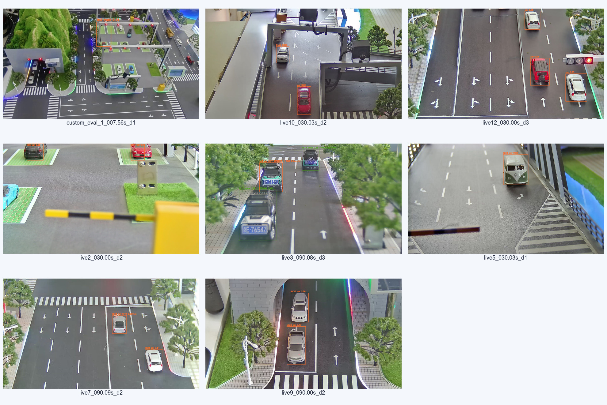

# STrans 智慧交通视觉感知与管理系统项目总结报告

## 1. 报告信息

| 项目 | 内容 |
|---|---|
| 项目名称 | 基于多源视觉感知的智慧交通沙盘监测与分析系统 |
| 软件名称 | STrans（Smart Transportation Sensing System） |
| 报告版本 | V1.0 |
| 总结日期 | 2026-07-14 |
| 项目阶段 | 结题交付 |
| 事实基线 | `LING` 分支 `b0f3be2` 及当前结题工作区 |

本报告依据当前仓库代码、Git 提交历史、CodeGraph 结构索引、自动化测试、浏览器系统遍历和 F 盘真实沙盘视频结果编写。方案设想与已实现功能分开表述；没有代码、测试或真实运行证据的能力不计入完成成果。

## 2. 项目背景与问题定义

智慧交通沙盘将道路、车辆、建筑和摄像头缩小到有限空间内，为交通感知算法和管理系统提供了可重复演示环境，但也引入了明显的领域差异：车辆在 1080p 画面中往往只有数十像素，树木、桥梁和排队车辆造成遮挡，沙盘车牌尺寸极小，塑料路面反光、箭头和车道线又容易触发异常误报。同时，RTSP、MJPEG、手机视频、本地图片和录像等输入协议不统一，单独运行识别脚本无法支撑账号权限、历史查询、告警处置和证据留存等工程需求。

项目最终聚焦三个相互关联的问题：

1. 如何在沙盘小目标、遮挡和极小车牌条件下形成较稳定的车辆—轨迹—车牌结果；
2. 如何控制道路标线、反光、阴影、相机抖动和合法交通参与者引发的道路异常误报；
3. 如何将多源视频、视觉算法、道路空间分析和管理功能串联为可运行、可追溯的完整软件系统。

## 3. 项目目标与成果边界

### 3.1 建设目标

- 建立多源视频统一接入和多路摄像头管理能力；
- 完成车辆检测、跟踪、车牌识别和白名单软件决策；
- 完成道路异物、道路行人和可选道路破损候选检测；
- 将视觉结果映射到二维道路模型，形成速度估计、车道/路口归属、禁停和拥堵热力图；
- 建立认证授权、历史、告警、证据、审计、自适应调度和智能报告等工程闭环；
- 通过自动化、浏览器和真实沙盘视频形成可复查的结题证据。

### 3.2 成果边界

当前交付成果是“二维道路模型 + 多源视觉分析 + Web 管理闭环”。白名单模块只输出软件层放行/拦截建议，没有接入物理闸机；独立碰撞识别、信号灯识别、完整跨线进出流量和三维数字孪生未进入当前主链路，不作为已完成成果。

道路异常按“候选检测 + 人工复核”定位；非参考摄像头速度是估计值；道路建模 JSON 需人工审核后发布。这些边界保证结题结论与现有证据一致。

## 4. 已完成工作

### 4.1 视频接入与摄像头管理

系统通过 CameraHub 和 VideoStreamService 统一接入 RTSP/MJPEG、手机或 USB 摄像头、本地图片和本地录像。已实现摄像头新增、修改、删除、连通性测试、单路/批量启停、状态查询、原始 MJPEG 和模型标注 MJPEG。每路视频由独立线程维护最新帧，具备失败重试和短时断流重连能力；日志、状态和审计中的视频地址经过脱敏。

### 4.2 车辆、跟踪、车牌与白名单

车辆感知主链路以 YOLO 检测和 ByteTrack 跟踪为基础，叠加道路 ROI、面积、外观纹理、视觉 ID 恢复、框平滑、可信轨迹短时预测和重叠框抑制。系统按场景判断近景/远景，远景时裁剪重点区域并提高推理尺寸；车辆数采用多帧中值稳定。

车牌模块使用 HyperLPR3，先对车辆裁剪区域执行 OCR，再以周期全帧 OCR 补充。识别文本与车辆轨迹绑定，经纠错、预算轮转、加权投票和多帧确认后进入白名单匹配。白名单结果形成 `allow/deny` 软件决策并进入事件、历史和证据链。

### 4.3 道路异常识别

道路异常与车辆监控被设计为两个独立任务模式。异常模式在道路 ROI 内组合稀疏光流、背景差分、自适应阈值、亮度、Lab 色差、HSV 暖色、纹理、轮廓和多帧 IoU；YOLO/ByteTrack 的车辆与行人结果用于解释合法道路使用者，近期合法框记忆用于抑制车辆离开后形成的“空位”误报。静态图片使用独立外观分支，可选道路破损模型作为补充。

### 4.4 道路分割、空间映射和交通状态

SegFormer-B0 Cityscapes 模型输出道路二值掩膜，为移动或未标定视角的画面热力图提供道路约束。固定摄像头通过标定点和 RANSAC 单应矩阵，将车辆框底边中心映射到二维道路世界坐标，再判断车道、路口、道路有效性和持续停留。拥堵评分以活跃唯一轨迹数量为主、平均速度为辅，描述近期交通状态而非无限累计轨迹。

### 4.5 道路建模辅助工具

项目已将原外部道路建模工具的主页面最小运行集完整纳入仓库和前端构建。管理员可以在同源页面编辑节点、节点组、平行车道、建筑物、摄像头和标定点，导出包含可编辑模型与派生逻辑的 `road_logic_modeler.v1` JSON。项目内还提供仅监听本机的可选 RTSP 单帧桥接。

该工具的定位是“道路空间语义和算法配置生产工具”，不参与每帧模型推理。当前发布仍采用人工审核与版本留存，避免未校验模型直接影响实时道路分析。

### 4.6 Web 管理与数据闭环

系统完成 React 监控大屏和 FastAPI 业务接口，具备验证码、注册登录、会话、管理员/普通用户权限、用户管理、摄像头、白名单、模型配置、自适应调度、历史、告警处置、证据导出、审计和智能报告。统一 `AnalysisResult` 将检测框、轨迹、车牌、交通统计、事件、耗时和扩展元数据贯穿前端、道路逻辑和 SQLite。

告警通过 `event_id` 与分析记录、原始帧、标注帧和结构化 JSON 关联，证据包使用 SHA-256 检查文件完整性。管理员操作进入审计日志，外部报告密钥和视频源地址使用脱敏方式展示。

### 4.7 自适应调度与系统监控

SystemMonitor 采集 CPU、内存、GPU、显存和推理耗时；AdaptiveModelScheduler 根据任务模式、静态/实时来源和资源压力选择 quality、balanced、realtime、protect、anomaly 或 manual 档位，动态调整模型、分辨率、阈值和检测间隔。1.5 秒资源缓存和 8 秒非保护档滞回用于减少频繁切换，protect 档在资源接近上限时立即降级。

## 5. 技术路线与关键设计

### 5.1 总体技术路线

系统采用 React + FastAPI + 本地视觉模型 + SQLite 的单机边缘部署架构，并为远程算法和智能报告保留可选接口。主数据流为：

```text
多源视频
  → CameraHub / VideoStreamService
  → LocalModelService 或 RoadAnomalyService
  → RoadLogicService / RoadMaskService
  → AnalysisResult
  → React 实时展示 + SQLite 历史/告警/证据
```


*图 5-1 STrans 逻辑组件架构。系统由采集接入、视觉感知、交通业务逻辑、接口展示和离线道路配置工具组成，统一结果最终进入 React 大屏、SQLite 与告警证据链。*

该架构体现了“算法能力服务化、结果契约统一化、道路配置独立化”的设计思路。CameraHub 统一输入，感知服务负责像素级结果，RoadLogicService 将其转换为道路语义，FastAPI 和 AnalysisStore 则完成展示与持久化闭环。

### 5.2 模型、几何、时序和业务规则融合

项目没有把识别质量完全寄托于单一模型，而是采用四类证据协同：

- 模型感知：YOLO、ByteTrack、HyperLPR3、SegFormer 和可选路损模型；
- 几何约束：道路 ROI、框尺寸、重叠关系、单应矩阵、车道和路口；
- 时序记忆：轨迹恢复、框平滑、短时预测、多帧 OCR、候选确认和背景更新；
- 业务规则：白名单、禁停、拥堵、角色权限、告警处置和证据归档。

该路线适合标注数据有限的沙盘场景：通用模型负责发现和解释目标，几何和时序规则补充稳定性，业务层保证结果可管理和可复核。

### 5.3 任务隔离与统一数据契约

车辆监控关注车辆、车牌、速度、白名单和交通状态；道路异常关注异物、道路行人和路损候选。两类任务分别调度和展示，避免异常框进入车辆统计。与此同时，两类结果仍使用统一 `AnalysisResult`，使 API、数据库、前端和远程算法服务保持一致接口。

### 5.4 本地优先与可降级

正式识别优先使用本地 CUDA；GPU 不可用时可降级 CPU，资源紧张时降低模型尺寸和分析频率，远程算法服务不可用时保持本地链路。SQLite 作为单机数据库减少部署和运维成本，适合课程实训和沙盘交付场景。

## 6. 工程实施与算法演进

项目开发过程可以概括为“先打通纵向闭环，再围绕真实误差做迭代，最后补齐测试、工具和交付证据”。


*图 6-1 核心算法演进路线。提交证据串联了可行性验证、沙盘适配、实时主链路、车辆/车牌稳定、道路语义增强、资源与异常优化和结题集成。*

演进主线不是单纯更换更大模型，而是先提高召回，再逐步加入道路约束、时序记忆和业务规则抑制误报，最后把真实设备负载、数据闭环和交付测试纳入运行体系。图中提交节点为阶段性证据，用于解释“问题出现—方案调整—工程验证”的因果关系。

| 阶段 | 主要工作 | 工程价值 |
|---|---|---|
| 视频闭环 | 建立 FastAPI、React、手机/网络视频和 MJPEG | 证明输入到 Web 的最小链路可运行 |
| 核心感知 | 集成 YOLO、ByteTrack、HyperLPR3、道路异常和 SQLite | 从视频展示升级为交通感知系统 |
| 鲁棒性优化 | 车辆去重、轨迹平滑、OCR 轮转、车牌关联和远近视角 | 针对小目标、遮挡和排队场景优化 |
| 管理闭环 | 账号、摄像头、白名单、历史、告警、审计 | 使算法结果可操作、可查询、可追溯 |
| 道路理解 | 单应映射、画面热点、SegFormer 道路约束和道路示意图 | 将像素检测转换为道路空间状态 |
| 异常增强 | 光流、合法目标解释、颜色/纹理/形状和多帧确认 | 降低相机移动、光照和道路设施误报 |
| 运行保障 | 自适应调度、证据链、录像留存和导出 | 提升资源适应性和实验可复现性 |
| 结题纠偏 | 远端同步、补齐道路建模资产、测试和文档 | 保证提交说明、实际文件和交付证据一致 |

算法演进不是简单提高阈值或更换模型，而是把真实失败案例转化为规则、状态和测试：车辆重框推动多条件去重，排队后车漏 OCR 推动预算轮转，热点漂到非道路区域推动 SegFormer 掩膜，道路箭头误报则进一步暴露道路标线抑制和事件生命周期的改进需求。

## 7. 测试与验证结果

### 7.1 自动化与工程检查

原始测试基线只有 19 项局部测试，无法证明主业务闭环。本轮补充认证、白名单、SQLite 数据闭环、摄像头、自适应调度、道路几何、真实视频工具、验证码和道路建模测试后，最终结果如下：

| 批次 | 通过/计划 | 结果 |
|---|---:|---|
| 后端 Python | 62/62 | 通过 |
| 前端 JavaScript | 19/19 | 通过 |
| 主项目自动化 | 81/81 | 通过 |
| 道路建模工具 Python（含桥接 6 项） | 21/21 | 通过 |
| 道路建模工具 Node 脚本组 | 5/5 | 通过 |
| 全部测试/脚本单元 | 107/107 | 通过 |

Python `compileall`、Vite 生产构建和 SQLite `ResourceWarning` 失败门禁均通过。100% 仅表示已执行用例全部通过，不代表全部需求和算法精度达到 100%。

### 7.2 浏览器系统测试

使用 Playwright 对管理员、普通用户和道路建模页面执行 17 个检查点，17 个通过。覆盖登录、实时监控、历史、告警、账号、白名单、摄像头、模型、调度、用户、审计、报告、道路建模、角色可见性和两种屏幕分辨率。道路建模页控制台为 0 错误、0 警告；主要业务请求在遍历期间返回成功。

本轮测试发现并修复 SQLite 连接未及时关闭、前端残留无效摄像头类型、自定义第 13 路源不可见和道路建模资产未随仓库交付等问题。

### 7.3 F 盘真实视频与 CUDA 验证

真实数据包含 12 路沙盘录像和一段综合演示视频。离线测试对 13 段视频各均匀抽取 5 帧，共 65 帧；全部成功读取并完成 CUDA 推理。

| 指标 | 结果 |
|---|---:|
| 采样帧 | 65 |
| 成功读取 | 65 |
| 有系统检测输出的帧 | 36（55.38%） |
| 检测目标总数 | 72 |
| 稳定车辆计数合计 | 68 |
| 不同车牌文本 | 5 |
| 平均推理耗时 | 683.20 ms |
| P50 / P95 | 328.82 / 2856.65 ms |
| 最大值 | 4122.53 ms |



*图 7-1 真实沙盘代表识别结果。拼图覆盖综合远景、多车道路、近景车牌、单车与无明显目标场景，展示模型在不同尺度和背景下的输出。*

该图用于证明真实数据链路和多场景适应性，不能替代人工真值评测。多车框与近景车牌体现了有效结果，而远景疑似误检、细分类波动和空场景对照则保留了算法迭代所需的失败证据。

同批样本 CPU 功能预跑平均/P50/P95 为 1158.06/783.86/3469.94 ms；CUDA 平均耗时下降约 41.0%，P50 下降约 58.1%。首次模型与 CUDA 初始化、OCR 密集场景和 CPU 侧车牌处理会造成高尾延迟。

前端使用 F 盘 live12 录像作为自定义源连续运行约 369 秒，记录 209 个有效耗时样本，平均/P50/P95 分别为 948.13/666.50/3224.13 ms，平均稳定车辆数 3.01。视频解码约 16 FPS，而包含车辆、OCR、异常和持久化的综合分析更新约 0.57 次/秒，两者不能混为同一帧率指标。

### 7.4 评测边界

当前真实数据尚未完成逐帧人工框、车牌和事件真值标注，因此“有检测结果的帧数、目标数、车牌文本数”是系统输出统计，不是 Precision、Recall、F1 或整牌准确率。项目可以证明主链路可运行、代表场景能产生合理结果，也保留了失败案例，但不能据此宣称识别精度已经全面达标。

## 8. 项目成果与创新点

### 8.1 面向沙盘小目标的复合稳态感知

通过低阈值保召回、道路 ROI、外观可信度、ByteTrack、视觉 ID 恢复、框平滑、短时预测和多帧车辆数中值，将通用目标检测适配到小目标、遮挡和排队场景。该方法能够解释每一层对召回或误检的作用。

### 8.2 车辆—轨迹—车牌—白名单联合决策

车牌不作为独立 OCR 文本直接显示，而是与车辆轨迹绑定，结合车辆区域 OCR、全帧回退、预算轮转、文本修正和多帧确认，再进入白名单。该设计减少单帧识别波动对业务决策的直接影响。

### 8.3 可解释道路异常多线索融合

在缺少大规模沙盘异常真值的条件下，项目使用光流回答“相机是否移动”，用变化比例回答“是否为全局光照变化”，用 YOLO/ByteTrack 解释合法使用者，再用颜色、纹理、形状和时序筛选无法解释的局部变化。错误能够定位到具体证据层，便于下一轮调整。

### 8.4 视觉结果与二维道路模型融合

车辆检测框通过摄像头标定和单应矩阵进入统一道路空间，形成车道/路口归属、禁停和拥堵状态；移动视角再由道路语义分割约束画面热点。道路建模工具补齐了空间配置的生产入口，使几何模型不再只是手工 JSON。

### 8.5 从算法演示到软件工程闭环

项目不仅显示识别框，还建立账号、角色、摄像头、白名单、历史、告警、证据、审计、调度和报告。自动化、浏览器、CodeGraph 和真实视频相互补充，使“模块存在、流程可运行、结果可复查”分别有证据支撑。

## 9. 主要问题、风险与改进计划

### 9.1 道路标线误报

真实 live12 视频中，道路箭头持续形成 `road_obstacle_candidate`。这说明现有颜色、纹理和形状规则仍未覆盖所有高对比标线。下一阶段应建立道路箭头、虚线、反光和真实异物的真值回归集，引入标线方向性、道路模板和静态背景长期稳定特征，并按摄像头保存可版本化阈值。

### 9.2 事件洪泛

实时测试中 `road_obstacle` 和 `plate_review` 各写入 208 次，同类事件逐帧入库会淹没告警列表。应在持久化前增加“摄像头 + 类型 + 区域”的空间匹配、冷却时间、持续事件合并和 open/acknowledged/resolved 生命周期，区分算法帧级候选与业务事件。

### 9.3 真值与精度评测不足

65 帧 CUDA 结果具备运行与性能价值，但没有人工真值，无法计算严格精度。后续应按近景/远景、遮挡、车牌、正常道路、异物和路损建立分层数据集，输出车辆检测 Precision/Recall/F1、车牌检测率和整牌准确率、异常事件级 Precision/Recall、跟踪 ID Switch 及 P50/P95 时延。

### 9.4 设备与环境差异

当前正式结果来自 RTX 4050 Laptop、Python 3.14.3、PyTorch 2.11.0+cu126。不同摄像头画质、视角、GPU、Python 和依赖版本会影响兼容性、时延和部分识别结果。应固定交付环境清单、模型哈希和配置哈希；更换设备后重新标定、预热并执行同一回归集，而不是直接沿用当前性能结论。

### 9.5 工程覆盖缺口

独立 FastAPI TestClient 权限/错误码矩阵、完整道路异常状态机行为测试、视频断流恢复和 30–60 分钟长稳测试仍未完成。前端轮询请求在长时间运行下的负载也需量化。后续应将上述项目纳入持续集成质量门禁。

### 9.6 道路模型发布治理

道路建模已能导出统一 JSON，但仍依赖人工复制和审核。后续可增加草稿保存、结构校验、管理员发布、版本对比和一键回滚 API，并让运行配置记录模型版本，避免摄像头标定与道路模型错配。

## 10. 项目管理与软件工程经验

1. **先闭环后扩展**：先让视频、后端和前端连通，再加入复杂算法，避免模块各自可运行但系统无法演示；
2. **以真实失败驱动迭代**：重框、后车漏 OCR、非道路热点和箭头误报都形成了明确的改进对象；
3. **测试结论与覆盖范围分开**：已执行用例 100% 通过不等于需求 100% 覆盖，更不等于模型 100% 准确；
4. **提交说明不能替代交付核验**：道路建模曾出现提交描述与实际文件不一致，最终通过资产校验、测试和浏览器加载补齐；
5. **成功和失败素材同样重要**：正确车辆框证明主链路，箭头误报和事件洪泛则为后续算法与业务规则提供迭代依据；
6. **配置、代码、数据和证据必须版本一致**：摄像头、道路模型、权重、阈值和测试环境共同决定最终结果。

## 11. 主要交付成果

- 可运行的 FastAPI 后端和 React 监控大屏；
- 多源视频接入、车辆/车牌、道路异常、道路分割和道路逻辑模块；
- 认证权限、白名单、历史、告警、证据、审计、调度和智能报告功能；
- 项目内置道路建模页面及本机可选桥接；
- 107 个已执行测试/脚本单元和浏览器系统测试证据；
- F 盘真实视频 CUDA 结构化结果、代表截图和两段 H.264 答辩短片；
- 系统设计、算法设计、模块说明、测试计划/报告、图谱和 PPT 素材索引；
- 可编辑 PlantUML 用例图、组件图、部署图、活动图、时序图、状态图和算法演进图。

## 12. 结论

STrans 已完成从多源视频接入、视觉识别、道路空间分析到 Web 展示、权限管理、告警处置和证据归档的纵向闭环。自动化、浏览器和真实沙盘视频共同证明系统核心功能可以在已验证环境中运行；CUDA 使当前样本的平均推理耗时相对 CPU 功能预跑明显下降，道路建模工具也补齐了二维空间配置的生产入口。

项目的主要价值不在于堆叠多个模型，而在于将模型、几何、时序和业务规则组织为可解释、可管理、可测试的软件系统。与此同时，道路标线误报、事件洪泛、无完整真值、非参考速度估计和长稳测试不足仍是明确限制。结题答辩应同时呈现已完成闭环、真实识别结果和失败案例，以“当前成果可运行、边界可说明、后续改进有依据”作为最终结论。
