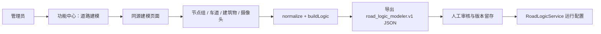
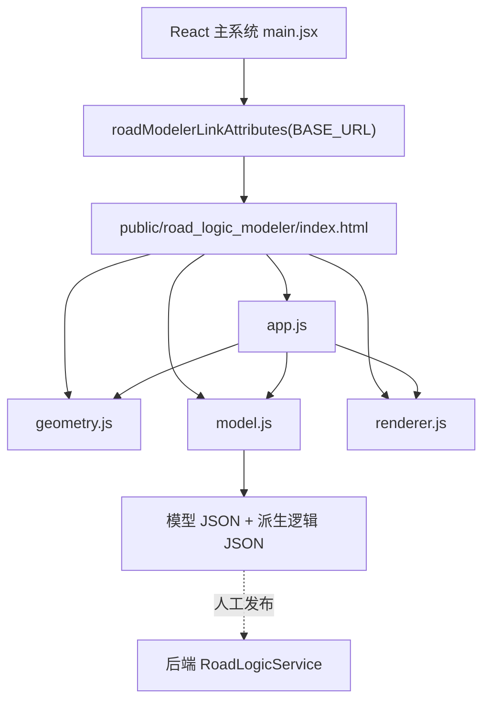
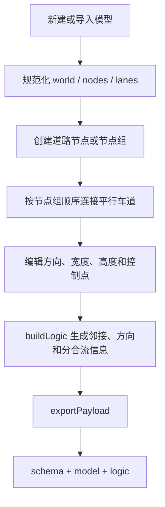

# M13：道路建模辅助工具 — 节点、车道与摄像头标定

## 1. 模块定位

道路建模工具用于把沙盘道路结构转化为机器可读 JSON，为后端的道路坐标映射、车道/路口归属、热力图和摄像头标定提供离线配置。它是管理员辅助工具，不参与每帧实时推理，也不改变识别算法结果。

本轮将 `tools/road_logic_modeler` 的完整算法、分析脚本与测试迁入结题仓库，并把主页面运行集纳入前端构建：

| 项目内文件 | 职责 |
|---|---|
| `frontend/public/road_logic_modeler/index.html` | 三栏建模界面和 Canvas 画布 |
| `styles.css` | 建模工具布局与交互状态样式 |
| `src/geometry.js` | 坐标、方向、距离和几何辅助计算 |
| `src/model.js` | 模型规范化、节点/车道操作、派生逻辑和 JSON 导出 |
| `src/renderer.js` | 网格、道路、建筑物、摄像头和标定点绘制及命中测试 |
| `src/app.js` | 模式切换、鼠标交互、属性编辑、导入导出和页面状态 |
| `frontend/src/roadModeler.js` | Vite 子路径兼容的入口地址与新标签页安全属性 |
| `tools/road_logic_modeler/server.py` | 仅监听 localhost 的静态页与 RTSP 单帧桥接 |
| `tools/road_logic_modeler/start_server.ps1` | 可选桥接启动脚本 |

六个核心静态文件已逐一与原目录执行 SHA-256 比对，结果 6/6 一致。页面由 Vite 直接作为静态资源发布，不再依赖固定 D 盘路径。

## 2. 参与者与用例

| 参与者 | 主要用例 | 权限 |
|---|---|---|
| 系统管理员 | 打开建模工具、创建节点组/车道、布置建筑物、添加摄像头、导入/导出模型 | 管理员入口可见 |
| 算法工程人员 | 维护道路拓扑、检查派生车道逻辑、生成后端配置 | 通过管理员入口或直接访问工具页 |
| 后端道路逻辑模块 | 读取经过审核的道路模型和摄像头标定 JSON | 运行时只读 |



## 3. 软件组件与边界



模块边界如下：

- 主系统只负责权限入口和页面导航，不直接修改建模工具内部状态；
- 建模工具在浏览器内完成编辑与导出，不要求主 FastAPI 在线；
- 当前没有 `postMessage` 或自动写回主系统的接口，模型发布仍需人工审核；
- RTSP 单帧抓取桥接已纳入项目，依赖本机 `127.0.0.1:8765` 和 FFmpeg，属于可选能力，不影响离线建模；
- 同源集成避免 `file:///D:/...`、固定盘符、跨设备 localhost 和 HTTPS 混合内容问题。

## 4. 核心数据与算法流程

### 4.1 道路拓扑建模



算法要点：

1. 节点组按中心、节点数、间距和截面角度生成平行道路端点；
2. 两组节点按对应顺序连接，自动形成多车道道路；
3. 节点移动时保持组内相对偏移，删除节点组时清理关联车道；
4. `normalize` 修复缺省字段、重复 ID 和失效引用；
5. `buildLogic` 从可编辑模型派生节点方向、车道关联、分流/汇流和摄像头逻辑；
6. `exportPayload` 同时输出可继续编辑的 `model` 与供算法读取的 `logic`。

### 4.2 摄像头几何与标定

摄像头由世界坐标位置、方向角、作用距离、画面标定点和目标绑定组成。拖拽摄像头方向柄时：

- `direction = atan2(Δy, Δx)` 并归一化到 `[0°, 360°)`；
- `range = max(拖拽距离, 最小距离)`；
- 画面点可绑定到世界点、网格、车道、建筑物等实体；
- 导出时保留标定元数据，但剔除仅供预览的 Base64 图像，控制模型文件体积。

### 4.3 输出契约

```json
{
  "schema": "road_logic_modeler.v1",
  "name": "road_logic_model",
  "world": { "width": 1200, "height": 760, "unit": "cm", "gridSize": 20 },
  "model": {
    "nodes": [],
    "lanes": [],
    "laneEndpointGroups": [],
    "buildings": [],
    "cameraCalibrations": [],
    "cameras": []
  },
  "logic": {}
}
```

## 5. 与实时算法的关系

道路建模工具本身不执行 YOLO、OCR 或异常检测。其输出进入后端后，主要支撑：

1. 通过摄像头标定点计算图像到道路世界坐标的单应变换；
2. 把车辆检测框的道路接触点归属到车道或路口；
3. 生成统一道路空间热力点、拥堵状态和禁停区域判断；
4. 为多摄像头结果提供共同坐标语义。

因此答辩时应将其描述为“算法配置与空间语义生产工具”，而不是新的识别模型。

## 6. 测试与验证证据

| 证据 | 结果 |
|---|---|
| 同源/子路径入口 | `/road_logic_modeler/index.html` 与 `/strans/road_logic_modeler/index.html` 均按规则解析 |
| 安全新标签页 | `target=_blank`，`rel=noopener noreferrer` |
| 静态资产 | 主页面和五个声明资源均存在、非空、可被 HTML 引用 |
| 模型逻辑 | 两组节点生成两条对应车道，导出 schema 正确 |
| 摄像头几何 | 东向角度 0°、作用距离 200 的回归通过 |
| 项目内 RTSP 桥接 | 6/6 通过：RTSP/RTSPS 接受、非法源拒绝、静态根目录有效 |
| 桥接启动冒烟 | `/api/health` 为 `ok`、FFmpeg 可用、主页 200 且标题正确；验证后端口关闭 |
| 工具 Python | 21/21 通过，含建模/分析算法与桥接 6 项 |
| 工具 Node | 5/5 回归脚本组通过 |
| Vite 生产构建 | 通过，静态目录进入 `dist/road_logic_modeler/` |
| Playwright | 页面标题、Canvas、工具栏、统计和初始 JSON 均可见；0 错误、0 警告 |

浏览器证据：`docs/结题材料/assets/road-modeler-page.png`。

## 7. 已知限制与后续演进

- 当前导出结果需人工审核后放入后端道路模型目录，尚未自动发布；
- RTSP 抓帧桥接已随仓库交付，但未并入主 FastAPI 权限体系，只能作为本机可选辅助，并保持 `127.0.0.1` 绑定；
- 建模核心脚本采用传统浏览器全局对象，CodeGraph 能索引文件但不能完整解析 IIFE 内部的全部函数符号；因此结构证据需与 VM 单测和浏览器验证结合；
- 后续可增加“保存草稿—校验—管理员发布—版本回滚”的受控 API，避免直接覆盖生产道路配置。

## 8. PPT 可用表述

> 项目不仅识别车辆，还提供道路空间语义的生产工具。管理员可以用可视化画布建立节点组、平行车道、建筑物和摄像头标定关系，系统导出统一的 `road_logic_modeler.v1` 模型，再由道路逻辑服务完成车辆到车道、路口和热力图的空间映射。

建议 PPT 配图：左侧放建模工具全页截图，右侧用三步箭头说明“可视化建模 → JSON 逻辑模型 → 实时道路分析”。
