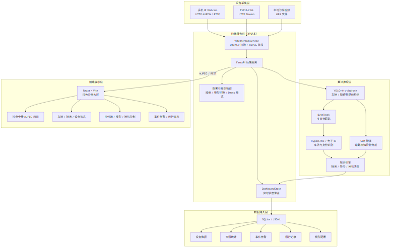
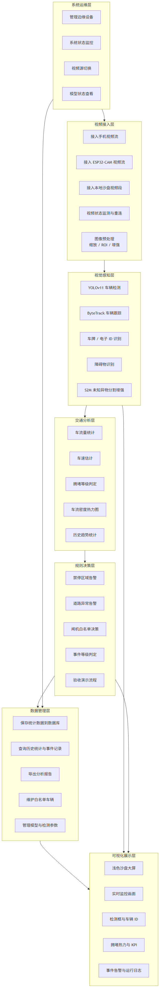
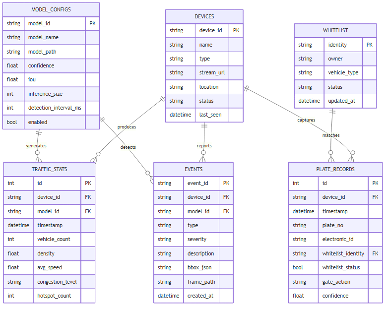

# 系统设计文档 V1.0

> **历史版本说明：** 本文记录早期设计探索，其中的 ESP32-CAM 采集方案已由项目组整体放弃，不属于最终架构、实现或交付范围。最终口径以 `docs/结题材料/18-系统设计方案V2.0.md` 为准。

| 项目名称 | 云边端协同智慧交通视觉感知系统 |
|---------|----------------------|
| 文档版本 | V1.0 |
| 编写日期 | 2026-07-06 |
| 审核状态 | 待审核 |

---

## 1. 系统概述

### 1.1 设计目标

本系统采用"云-边-端"三层协同架构，在校园 704 智慧交通沙盘场景下实现交通视觉感知。系统将计算任务分层卸载：端侧负责视频采集，边缘侧负责视频解码与推理调度，云端/边缘负责算法推理与 Web 服务。

### 1.2 设计原则

| 原则 | 说明 |
|------|------|
| 模块解耦 | 前端、后端、算法三个模块独立开发、独立部署，通过 REST API、MJPEG 视频流和算法 HTTP 接口通信 |
| 接口先行 | 先定义接口契约，再并行开发，降低协作耦合 |
| 降级容错 | 算法服务不可用时，系统降级为纯视频监控模式，不崩溃 |
| 配置外置 | 所有可调参数通过 .env 文件管理，不硬编码 |
| 演示优先 | 10 天周期内优先保证验收闭环稳定，复杂能力提供 demo/mock 兜底 |

---

## 2. 系统架构设计

### 2.1 三层架构总览

```
┌─────────────────┐     ┌──────────────────────────┐     ┌─────────────────┐
│     端（Device）  │     │      边（Edge）           │     │   云/边缘（Cloud）│
│                  │     │                          │     │                 │
│  ┌────────────┐  │     │  ┌────────────────────┐  │     │ ┌─────────────┐ │
│  │ 手机摄像头  │  │     │  │   后端服务          │  │     │ │ 算法推理服务 │ │
│  │ IP摄像头APP │  │     │  │   (FastAPI)        │  │     │ │ (Flask)     │ │
│  └─────┬──────┘  │     │  │                    │  │     │ │             │ │
│        │         │     │  │  ┌──────────────┐  │  │     │ │ ┌─────────┐ │ │
│        │ RTSP/   │     │  │  │ 视频流管理    │  │  │     │ │ │YOLOv11  │ │ │
│        │ 推流    │     │  │  │ (OpenCV拉流)  │  │  │     │ │ │检测     │ │ │
│        ▼         │     │  │  └──────┬───────┘  │  │     │ │ ├─────────┤ │ │
│  ┌────────────┐  │     │  │         │          │  │     │ │ │ByteTrack│ │ │
│  │ 局域网WiFi  │──┼─────┼─►│         ▼          │  │     │ │ │跟踪     │ │ │
│  └────────────┘  │     │  │  ┌──────────────┐  │  │     │ │ ├─────────┤ │ │
│                  │     │  │  │ MJPEG/REST   │  │  │     │ │ │HyperLPR3│ │ │
│                  │     │  │  │ 提供前端数据   │  │  │     │ │ │车牌识别 │ │ │
│                  │     │  │  └──────────────┘  │  │     │ │ ├─────────┤ │ │
│                  │     │  │                    │  │     │ │ │交通分析  │ │ │
│                  │     │  │  HTTP调用算法服务  │──┼─────┼─►│ │拥堵/车速 │ │ │
│                  │     │  │                    │  │     │ │ └─────────┘ │ │
│                  │     │  └────────────────────┘  │     │ └─────────────┘ │
│                  │     │                          │     │                 │
│                  │     │  ┌────────────────────┐  │     │                 │
│                  │     │  │   前端服务          │  │     │                 │
│                  │     │  │   (React + Vite)   │  │     │                 │
│                  │     │  │                    │  │     │                 │
│                  │     │  │  实时监控页         │  │     │                 │
│                  │     │  │  数据统计页         │  │     │                 │
│                  │     │  │  事件告警页         │  │     │                 │
│                  │     │  │  系统设置页         │  │     │                 │
│                  │     │  └────────────────────┘  │     │                 │
│                  │     │                          │     │                 │
└─────────────────┘     └──────────────────────────┘     └─────────────────┘
```

### 2.2 端-边-云职责划分

| 层级 | 物理设备 | 职责 | 技术选型 |
|------|----------|------|----------|
| **端** | 手机 | 视频采集、RTSP 推流 | IP 摄像头 APP（安卓） |
| **边** | 笔记本电脑 | 视频拉流解码、MJPEG 转发、REST API、Web 前端服务、算法调度 | FastAPI + OpenCV + React/Vite |
| **云/边缘** | 笔记本或 GPU 云 | 算法推理（检测、跟踪、识别、分析） | YOLOv11 + ByteTrack + HyperLPR3 + S2M 增强 |

> **部署说明：** 开发阶段算法服务与后端服务均运行在笔记本上（localhost）；演示阶段可拆分到 GPU 云以体现"云边协同"。

### 2.3 验收功能闭环

系统围绕 704 智慧交通沙盘形成以下可演示闭环：

```text
手机/ESP32-CAM 视频采集
    ↓
后端拉流与设备状态监测
    ↓
算法模块识别车辆、车牌/电子ID、障碍物和道路区域事件
    ↓
规则模块生成白名单通行决策、禁停告警、拥堵热力图和道路异常告警
    ↓
SQLite/日志记录统计与事件
    ↓
Web Dashboard 展示视频、热力图、系统状态、设备状态、模型配置和历史趋势
```

其中真实视觉能力负责“看见当前画面”，Mock/数字孪生能力负责“稳定展示速度、排队、拥堵演化”等沙盘静态车辆难以直接获得的交通状态。

---

## 3. 模块设计

### 3.1 模块总览

```
traffic-vision/
│
├── backend/                    # 后端服务
│   ├── app/
│   │   ├── main.py             # FastAPI 入口
│   │   ├── core/
│   │   │   ├── config.py       # 配置管理
│   │   │   └── logger.py       # 日志配置
│   │   ├── routers/            # API 路由
│   │   │   ├── video.py        # 视频流管理
│   │   │   ├── analysis.py     # 分析数据
│   │   │   ├── config.py       # 参数配置
│   │   │   ├── devices.py      # 边缘设备管理
│   │   │   ├── models.py       # 模型管理
│   │   │   ├── system.py       # 系统资源监控
│   │   │   ├── whitelist.py    # 白名单与闸机通行决策
│   │   │   └── report.py       # 报告生成
│   │   ├── schemas/            # 数据模型（Pydantic）
│   │   └── services/           # 业务逻辑
│   │       ├── video_service.py    # 视频流管理
│   │       ├── algorithm_service.py # 算法调用
│   │       ├── device_service.py    # 设备状态与心跳
│   │       ├── monitor_service.py   # CPU/GPU/内存监控
│   │       ├── whitelist_service.py # 白名单比对
│   │       └── storage_service.py   # SQLite/JSONL 持久化
│   ├── .env                    # 环境配置
│   ├── data/
│   │   └── strans.db           # SQLite 数据库（运行时生成）
│   └── requirements.txt
│
├── frontend/                   # 前端服务
│   ├── src/
│   │   ├── main.jsx           # React 单页入口，包含沙盘大屏主要组件
│   │   └── styles.css         # 浅色沙盘大屏样式
│   ├── package.json
│   └── index.html
│
├── algorithms/                 # 算法模块
│   ├── models/                 # 模型权重
│   │   └── yolov11s-visdrone.pt
│   ├── detection/              # 检测与跟踪
│   │   ├── detector.py
│   │   └── tracker.py
│   ├── ocr/                    # 车牌识别
│   │   └── plate_recognition.py
│   ├── traffic/                # 交通分析
│   │   ├── flow_counter.py
│   │   ├── speed_estimator.py
│   │   ├── congestion.py
│   │   └── accident.py
│   ├── traffic_light/          # 红绿灯识别
│   │   └── hsv_detector.py
│   ├── inference/
│   │   ├── pipeline.py         # 推理流水线
│   │   └── server.py           # Flask 推理服务
│   └── data/                   # 数据集
│       ├── raw/
│       └── annotated/
│
├── simulation/                 # 轻量数字孪生/Mock 交通流
│   ├── road_network.json       # 沙盘道路拓扑
│   ├── simulator.py            # 车辆流动、排队、拥堵演化
│   └── signal_controller.py    # 红绿灯配时策略（可选）
│
├── docs/                       # 文档
│   ├── 需求分析文档_V1.0.md
│   └── 系统设计文档_V1.0.md
│
└── README.md
```

### 3.2 后端模块设计

#### 3.2.1 模块结构

```
backend/app/
│
├── main.py                 # 应用入口，注册路由、中间件
│
├── core/
│   ├── config.py           # Settings 类，读取 .env 配置
│   └── logger.py           # loguru 日志配置
│
├── schemas/                # Pydantic 数据模型
│   └── __init__.py         # 所有请求/响应/算法输出模型
│
├── routers/                # API 路由层（仅做参数校验和转发）
│   ├── video.py            # /api/video/*
│   ├── analysis.py         # /api/analysis/*
│   ├── config.py           # /api/config/*
│   └── report.py           # /api/report/*
│
└── services/               # 业务逻辑层
    ├── video_service.py    # 视频流管理（拉流、分帧、推送）
    └── algorithm_service.py # 算法调用（HTTP 调用推理服务）
```

#### 3.2.2 核心类设计

**VideoStreamService（视频流服务）**

| 方法 | 职责 |
|------|------|
| `start(source)` | 连接视频源，启动后台读帧任务 |
| `stop()` | 停止读帧，释放资源 |
| `get_latest_frame()` | 获取最新一帧（ndarray） |
| `get_latest_frame_base64()` | 获取最新一帧（base64 字符串） |
| `is_running` | 视频流是否正在运行 |

**AlgorithmService（算法调用服务）**

| 方法 | 职责 |
|------|------|
| `invoke(frame_b64)` | 调用算法推理服务，返回 InferenceResult |
| `get_config()` | 获取当前检测配置 |
| `update_config(req)` | 更新检测配置 |
| `_mock_result(frame_b64)` | 算法服务不可用时返回假数据（降级） |

**DeviceService（设备管理服务）**

| 方法 | 职责 |
|------|------|
| `register(device)` | 注册视频源设备 |
| `list_devices()` | 查询设备列表 |
| `check_status(device_id)` | 检测视频流或设备是否在线 |
| `update_last_seen(device_id)` | 更新最近心跳时间 |

**MonitorService（系统监控服务）**

| 方法 | 职责 |
|------|------|
| `collect()` | 采集 CPU、内存、GPU（可选）、视频流和算法服务状态 |
| `get_latest()` | 返回最近一次系统状态快照 |

**WhitelistService（白名单服务）**

| 方法 | 职责 |
|------|------|
| `match(plate_or_id)` | 根据车牌号或电子 ID 查询白名单 |
| `decide_gate_action(match_result)` | 生成 allow/deny 通行决策 |
| `list_whitelist()` | 查询白名单车辆 |

**StorageService（数据持久化服务）**

| 方法 | 职责 |
|------|------|
| `save_event(event)` | 保存告警和通行决策事件 |
| `save_stats(stats)` | 保存每分钟统计快照 |
| `query_history(range)` | 查询历史统计和事件 |

### 3.3 算法模块设计

#### 3.3.1 推理流水线

```
输入帧 (base64)
    │
    ▼
┌──────────────┐
│ base64 解码   │
│ → ndarray     │
└──────┬───────┘
       │
       ▼
┌──────────────┐
│ YOLOv11 检测  │  → detections: [{bbox, class, confidence}]
└──────┬───────┘
       │
       ▼
┌──────────────┐
│ ByteTrack 跟踪│  → detections: [{track_id, bbox, class, confidence}]
└──────┬───────┘
       │
       ▼
┌──────────────────────────────────────────────┐
│ 并行计算各维度                                │
│                                              │
│  ┌──────────┐ ┌──────────┐ ┌──────────────┐ │
│  │车流量统计 │ │车速估计   │ │车牌识别       │ │
│  │ROI 计数   │ │位移/时间  │ │HyperLPR3     │ │
│  └─────┬────┘ └─────┬────┘ └──────┬───────┘ │
│        │            │             │          │
│  ┌─────┴────────────┴─────────────┴──────┐  │
│  │         拥堵检测 + 事件检测 + 红绿灯    │  │
│  └───────────────────────────────────────┘  │
└──────────────────┬───────────────────────────┘
                   │
                   ▼
            InferenceResult JSON
            （统一输出格式）
```

#### 3.3.2 推理服务接口

算法模块以独立 Flask 服务形式部署，提供 HTTP 接口：

| 接口 | 方法 | 请求 | 响应 |
|------|------|------|------|
| `/infer` | POST | `{"image": "<base64>", "confidence": 0.5, "iou": 0.45}` | InferenceResult JSON |
| `/health` | GET | - | `{"status": "ok"}` |

#### 3.3.3 算法选型

| 功能 | 模型/算法 | 选择理由 |
|------|-----------|----------|
| 车辆检测 | YOLOv11s-visdrone | 更贴近小目标/俯视视角车辆检测，适合沙盘多车小目标场景 |
| 多目标跟踪 | ByteTrack | 轻量，不依赖外观特征，适合 CPU 部署 |
| 车牌识别 | HyperLPR3 | 车牌专用引擎，95%+ 精度，5-10ms/张，内置透视矫正 |
| 车速估计 | 像素位移法 | 简单有效，无需训练 |
| 拥堵检测 | 密度+速度阈值法 | 可解释性强，参数可调 |
| 事故检测 | 异常运动检测 | 不需训练，基于规则 |
| 红绿灯识别 | HSV 颜色阈值 | 计算量极小，实时性好 |
| 障碍物识别增强 | S2M 异常分割 | 对 YOLOv11 未覆盖或边界不规则的道路异物进行 ROI 内精细分割 |

---

## 4. 接口设计

### 4.1 REST API

| 接口 | 方法 | 路径 | 说明 |
|------|------|------|------|
| 启动视频流 | POST | `/api/video/start` | 传入视频源地址，开始拉流 |
| 停止视频流 | POST | `/api/video/stop` | 停止拉流 |
| 视频流状态 | GET | `/api/video/status` | 查询当前运行状态 |
| 历史数据 | GET | `/api/analysis/history` | 查询指定时间段统计数据 |
| 事件列表 | GET | `/api/analysis/events` | 获取最近事件 |
| 获取配置 | GET | `/api/config/threshold` | 获取当前检测参数 |
| 修改配置 | PUT | `/api/config/threshold` | 修改检测参数 |
| 设备列表 | GET | `/api/devices` | 查询边缘设备和视频源 |
| 注册设备 | POST | `/api/devices` | 新增手机/ESP32-CAM/USB 摄像头 |
| 设备状态 | GET | `/api/devices/{id}/status` | 查询视频源在线状态 |
| 系统状态 | GET | `/api/system/status` | 查询 CPU/内存/GPU/服务状态 |
| 模型列表 | GET | `/api/models` | 查询可用模型 |
| 切换模型 | PUT | `/api/models/current` | 设置当前推理模型 |
| 白名单列表 | GET | `/api/whitelist` | 查询本地白名单车辆 |
| 通行决策 | POST | `/api/whitelist/decision` | 根据车牌/电子 ID 生成放行决策 |
| 生成报告 | POST | `/api/report/generate` | 生成分析报告 |
| 下载报告 | GET | `/api/report/download` | 下载报告文件 |

### 4.2 前端实时数据接口

当前可跑通版本采用“MJPEG 展示视频 + REST 轮询分析结果”的方式，避免 WebSocket 推帧在浏览器端解码和重连上的复杂度。

| 接口 | 方法 | 路径 | 返回内容 | 频率 |
|------|------|----------|------|
| 视频画面 | GET | `/api/video/mjpeg` | `multipart/x-mixed-replace` MJPEG 视频流 | 浏览器持续拉取 |
| 视频状态 | GET | `/api/video/status` | 当前视频源、帧率、分辨率、连接状态 | 约 0.7-1 秒 |
| 实时分析 | GET | `/api/analysis/latest` | 最新检测框、车辆统计、拥堵等级、事件摘要 | 约 0.7-1 秒 |
| 历史趋势 | GET | `/api/analysis/history` | 近期车流统计列表 | 页面轮询或查询时 |
| 事件告警 | GET | `/api/analysis/events` | 最近事件列表 | 页面轮询或查询时 |

### 4.3 算法服务接口（内部）

| 接口 | 方法 | 路径 | 说明 |
|------|------|------|------|
| 推理 | POST | `http://localhost:50051/infer` | 输入帧 base64，返回 InferenceResult |
| 健康检查 | GET | `http://localhost:50051/health` | 检查算法服务状态 |

### 4.4 请求/响应示例

**POST /api/video/start**

请求：
```json
{
  "source": "rtsp://192.168.1.100:8554/live"
}
```

响应：
```json
{
  "success": true,
  "message": "视频流已启动",
  "stream_id": "stream_1783091200"
}
```

**GET /api/analysis/latest 响应示例**

```json
{
  "frame_id": 1024,
  "timestamp": "2026-07-06T10:30:00",
  "model_id": "yolov11s-visdrone",
  "source_width": 1280,
  "source_height": 720,
  "detections": [
    {"bbox": [120, 80, 260, 200], "class": "car", "confidence": 0.92, "track_id": 7}
  ],
  "traffic_stats": {"current_count": 4, "density": 0.08, "congestion_level": "low"},
  "events": []
}
```

---

## 5. 数据模型设计

### 5.1 核心数据结构

系统采用“内存实时态 + SQLite/JSONL 落盘”的轻量数据方案。实时帧、最新检测结果保存在内存中；统计快照、车牌/电子 ID 通行记录、告警事件落盘保存，用于历史查询、测试报告和验收复查。核心数据结构如下：

#### InferenceResult（推理结果 - 每帧）

| 字段 | 类型 | 说明 |
|------|------|------|
| frame_id | int | 帧编号 |
| timestamp | str | 时间戳 ISO 8601 |
| image_annotated | str? | 标注后画面 base64（可选） |
| detections | Detection[] | 检测结果列表 |
| traffic_stats | TrafficStats | 交通统计 |
| events | TrafficEvent[] | 事件列表 |
| traffic_light | TrafficLight? | 红绿灯状态 |

#### Detection（单个检测）

| 字段 | 类型 | 说明 |
|------|------|------|
| track_id | int | 跟踪 ID |
| bbox | int[4] | 边界框 [x1, y1, x2, y2] |
| class | str | 类别（car/truck/bus/motorcycle） |
| confidence | float | 置信度 0-1 |
| speed_kmh | float? | 车速 km/h |
| plate | str? | 车牌号 |

#### TrafficStats（交通统计）

| 字段 | 类型 | 说明 |
|------|------|------|
| count_in | int | 进入车辆累计数 |
| count_out | int | 离开车辆累计数 |
| current_count | int | 当前画面内车辆数 |
| density | float | 车辆密度 |
| avg_speed | float? | 平均车速 |
| congestion_level | enum | 拥堵等级（低/中/高） |

#### Device（边缘设备）

| 字段 | 类型 | 说明 |
|------|------|------|
| device_id | str | 设备 ID |
| name | str | 设备名称 |
| type | enum | phone / esp32cam / usb / mock |
| stream_url | str | 视频流地址 |
| location | str | 部署位置 |
| status | enum | online / offline / error |
| last_seen | str | 最近心跳时间 |

#### GateDecision（通行决策）

| 字段 | 类型 | 说明 |
|------|------|------|
| plate_no | str? | 车牌号 |
| electronic_id | str? | ArUco/二维码电子车牌 ID |
| whitelist_status | bool | 是否在白名单 |
| gate_action | enum | allow / deny |
| confidence | float | 识别置信度 |
| reason | str | 决策原因 |

#### SystemStatus（系统状态）

| 字段 | 类型 | 说明 |
|------|------|------|
| cpu_percent | float | CPU 使用率 |
| memory_percent | float | 内存使用率 |
| gpu_percent | float? | GPU 使用率，无 GPU 时为空 |
| stream_status | enum | 视频流状态 |
| algorithm_status | enum | 算法服务状态 |

### 5.2 SQLite 表设计

| 表 | 主要字段 | 用途 |
|----|----------|------|
| devices | device_id, name, type, stream_url, location, status, last_seen | 设备管理 |
| events | event_id, type, severity, description, bbox, frame_path, created_at | 告警和异常事件 |
| traffic_stats | id, timestamp, vehicle_count, congestion_level, avg_speed, hotspot_count | 历史统计趋势 |
| plate_records | id, timestamp, plate_no, electronic_id, whitelist_status, gate_action, confidence | 车牌/电子 ID 识别记录 |
| model_configs | id, model_name, model_path, conf, iou, enabled | 模型配置 |

### 5.3 数据流转

```
算法服务产生 InferenceResult
        │
        ▼
后端 algorithm_service.invoke() 接收
        │
        ├──► GET /api/video/mjpeg  → 前端实时显示 MJPEG 画面
        │
        ├──► GET /api/analysis/latest → 前端轮询检测框与统计信息
        │
        └──► 内存缓存（最近 N 帧统计） → /analysis/history 查询
```

---

## 6. 前端页面设计

### 6.1 页面路由

| 路径 | 页面 | 说明 |
|------|------|------|
| `/` | Dashboard | 实时监控主页面 |
| `/statistics` | Statistics | 数据统计与图表 |
| `/events` | Events | 事件告警列表 |
| `/devices` | Devices | 边缘设备管理 |
| `/models` | Models | 模型选择与参数配置 |
| `/settings` | Settings | 系统参数配置 |

### 6.2 Dashboard 页面布局

```
┌─────────────────────────────────────────────────────┐
│ 顶部态势栏：STrans 智慧交通沙盘大屏 | 日期 | 实时状态 | 接入状态 │
├──────────────┬──────────────────────────────┬────────────────┤
│ 左侧态势面板  │ 中央沙盘主监控区              │ 右侧控制与告警   │
│ - 车流统计    │ - 沙盘全景 MJPEG 实时画面      │ - 视频源接入      │
│ - 拥堵热力    │ - 车辆/障碍物检测框叠加         │ - 模型状态        │
│ - 设备状态    │ - 热力提示与 LIVE 标识          │ - 闸机决策        │
│              │ - 多视角摄像头卡片             │ - 事件告警        │
├──────────────┴──────────────────────────────┴────────────────┤
│ 底部运行日志/事件时间线：展示视频接入、模型切换、闸机判定等操作 │
└─────────────────────────────────────────────────────┘
```

### 6.3 组件设计

| 组件 | 职责 | Props |
|------|------|-------|
| VideoPanel | 通过 `` 展示 MJPEG 视频流 + 叠加检测框 | `streamUrl`, `detections`, `sourceSize` |
| StatsPanel | 显示车流量/拥堵/车速统计 | `stats` |
| EventList | 事件告警列表 | `events` |
| TrendPanel | 展示车流量历史柱状趋势 | `history` |
| CameraTile | 多视角摄像头卡片 | `title`, `status` |
| DeviceTable | 设备列表和在线状态 | `devices` |
| SystemStatusBar | CPU/GPU/内存/服务状态 | `status` |
| ModelSelector | 模型选择和阈值配置 | `models`, `currentModel` |
| GateDecisionPanel | 白名单和闸机通行决策展示 | `decision` |

### 6.4 状态管理

| Store | 管理的状态 |
|-------|-----------|
| React `useState/useEffect` | 视频源、视频状态、实时分析结果、历史趋势、设备、模型、白名单和运行日志 |
| 定时轮询 | 每 700ms 刷新视频状态、Dashboard 状态和最新分析结果 |
| 派生状态 | 根据检测结果、模型状态和视频源状态计算 KPI、检测框比例和告警展示 |

---

## 7. 通信协议设计

### 7.1 端 → 边：RTSP 视频推流

| 项 | 内容 |
|----|------|
| 协议 | RTSP over TCP |
| 编码 | H.264 |
| 发起方 | 手机 IP 摄像头 APP |
| 接收方 | 笔记本 OpenCV `cv2.VideoCapture()` |
| 地址 | `rtsp://<手机IP>:8554/live` |

### 7.2 边 → 云/算法：HTTP 调用

| 项 | 内容 |
|----|------|
| 协议 | HTTP POST |
| 数据格式 | JSON |
| 请求体 | `{"image": "<base64>", "confidence": 0.5, "iou": 0.45}` |
| 响应体 | InferenceResult JSON |
| 超时 | 30 秒 |

### 7.3 边 → 前端：MJPEG + REST

| 项 | 内容 |
|----|------|
| 协议 | HTTP |
| 视频格式 | MJPEG (`multipart/x-mixed-replace`) |
| 数据格式 | JSON |
| 刷新频率 | 视频流由浏览器持续拉取；统计数据约 0.7-1 秒轮询 |
| 消息来源 | `/api/video/mjpeg`、`/api/video/status`、`/api/analysis/latest`、`/api/dashboard` |

---

## 8. 部署设计

### 8.1 开发环境部署

```
笔记本（一台）
├── 后端服务      localhost:8000   (FastAPI)
├── 前端服务      localhost:5173   (Vite dev server)
├── 算法服务      localhost:50051  (Flask)
├── SQLite 数据   backend/data/strans.db
└── 视频源        手机局域网推流 / 本地视频文件
```

### 8.2 演示环境部署

```
手机（端）          笔记本（边）              GPU云（云）
  │                   │                        │
  │ RTSP推流          │ HTTP调用                │
  └─────WiFi──────►  └────────局域网/内网────► │
                      │                        │
                   前端+后端                算法推理服务
                   localhost:8000           GPU 加速
                   localhost:5173
```

### 8.3 环境配置

**后端 .env 配置：**

| 变量 | 默认值 | 说明 |
|------|--------|------|
| HOST | 0.0.0.0 | 监听地址 |
| PORT | 8000 | 后端端口 |
| RTSP_URL | rtsp://192.168.1.100:8554/live | 手机推流地址 |
| DATABASE_URL | sqlite:///./data/strans.db | 本地 SQLite 数据库 |
| ALGORITHM_SERVER_URL | http://localhost:50051 | 算法服务地址 |
| FPS_TARGET | 15 | 目标处理帧率 |
| CORS_ORIGINS | ["http://localhost:5173"] | 前端地址 |
| DEMO_MODE | false | 算法或视频不可用时是否启用演示模式 |

**前端环境变量：**

| 变量 | 默认值 | 说明 |
|------|--------|------|
| VITE_API_BASE | http://localhost:8000 | 后端 API 地址 |

---

## 9. 技术选型汇总

| 层级 | 技术 | 版本 | 用途 |
|------|------|------|------|
| **后端框架** | FastAPI | 0.115 | REST API + MJPEG 视频流 |
| **ASGI 服务器** | Uvicorn | 0.34 | 异步服务 |
| **视频处理** | OpenCV | 4.10 | 拉流、解码、图像处理 |
| **数据校验** | Pydantic | 2.10 | 请求/响应模型 |
| **HTTP 客户端** | httpx | 0.28 | 调用算法服务 |
| **日志** | loguru | 0.7 | 结构化日志 |
| **轻量数据库** | SQLite | 3.x | 历史统计和事件落盘 |
| **系统监控** | psutil | 6.x | CPU/内存/进程状态 |
| **前端框架** | React | 19.x | SPA 应用 |
| **前端语言** | JavaScript/JSX | ES202x | 快速实现交互页面 |
| **构建工具** | Vite | 7.x | 开发服务器 + 打包 |
| **图标库** | lucide-react | 0.561 | 前端图标 |
| **检测模型** | YOLOv11s-visdrone | 11.x | 小目标车辆检测 |
| **跟踪算法** | ByteTrack | - | 多目标跟踪 |
| **车牌识别** | HyperLPR3 | 3.0 | 车牌识别（专用引擎） |
| **障碍物增强** | S2M | - | 道路未知异物异常分割增强 |
| **算法服务** | FastAPI/Flask 均可 | - | 推理 HTTP 服务 |

---

## 10. 异常处理设计

| 异常场景 | 处理策略 |
|----------|----------|
| 视频源连接失败 | 返回错误信息到前端，提示检查地址 |
| 视频流中断 | 后台自动重连，间隔 1 秒，最多 10 次 |
| 算法服务不可用 | 降级返回 mock 数据，前端正常显示（标注"模拟数据"） |
| 算法调用超时 | 跳过当前帧，继续处理下一帧 |
| MJPEG 断开 | 前端显示离线状态，用户可刷新或重新启动视频源 |
| 前端参数校验失败 | 表单即时提示，不发请求 |

---

## 11. 降级策略

| 级别 | 触发条件 | 系统行为 |
|------|----------|----------|
| 正常 | 所有服务可用 | 全功能运行 |
| 降级1 | 算法服务不可用 | 仅显示视频画面，不显示检测框和统计 |
| 降级2 | 算法服务不可用 + mock 模式 | 显示视频 + 假数据（用于开发调试） |
| 降级3 | 视频源不可用 | 显示"无视频信号"，保留历史数据页面 |

---

## 12. 系统图示设计

本节按照设计报告要求补充三类关键图示：技术架构分层图、功能架构分层图和数据库 ER 图。图示用于说明系统的技术部署边界、功能分层关系和核心数据表关系。

### 12.1 技术架构分层图

技术架构按照“设备采集层、边缘服务层、算法推理层、数据持久层、前端展示层”分层。当前可跑通版本以笔记本作为边缘服务器，通过 OpenCV 拉取手机/IP 摄像头/本地视频源，后端以 MJPEG 和 REST API 向 React 前端提供视频与分析数据；算法侧以 YOLOv11、ByteTrack、HyperLPR3 和 S2M 增强模块提供检测、跟踪、识别与异常分割能力。



### 12.2 功能架构分层图

功能架构按照“视频接入、视觉感知、交通分析、规则决策、数据管理、可视化展示、系统运维”七个功能层展开。各层之间由视频帧、检测结果、统计数据和事件记录串联，支撑沙盘监控演示闭环。



### 12.3 数据库 ER 图

第一版采用轻量 SQLite 或 JSONL 方案即可满足验收和复查需求。核心实体包括边缘设备、模型配置、交通统计、事件记录、通行记录和白名单车辆。后续若需要多用户或长期存储，可平滑迁移到 MySQL/PostgreSQL。


