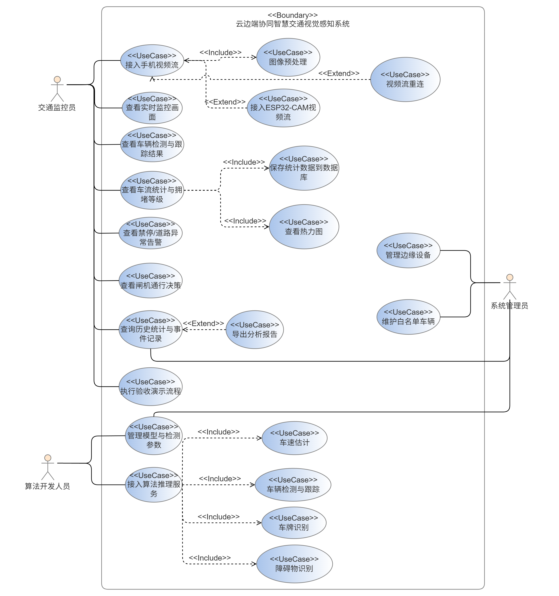

# 需求分析文档 V1.0

> **历史版本说明：** 本文记录早期需求探索，其中的 ESP32-CAM 采集方案已由项目组整体放弃，不属于最终需求、实现或验收范围。最终口径以 `docs/结题材料/17-需求分析报告V2.0.md` 为准。

| 项目名称 | 云边端协同智慧交通视觉感知系统 |
|---------|----------------------|
| 文档版本 | V1.0 |
| 编写日期 | 2026-07-06 |
| 审核状态 | 待审核 |

---

## 1. 项目背景

### 1.1 问题描述

传统交通监控系统依赖人工巡查和固定摄像头，存在以下痛点：

- **实时性不足**：人工巡查无法 7×24 小时覆盖，事件发现滞后
- **智能化程度低**：传统摄像头仅录制不分析，数据利用率低
- **算力集中风险**：纯云端架构延迟高，网络中断时系统瘫痪
- **成本高昂**：全量视频上传云端消耗大量带宽和存储

### 1.2 项目目标

构建一套"云-边-端"三层协同的智慧交通视觉感知系统，在校园 704 智慧交通沙盘场景下实现：

1. 实时车辆检测、跟踪与车流量统计
2. 车速估计与车牌识别
3. 交通拥堵等级判定与事件告警
4. 红绿灯状态识别
5. Web 端实时监控与数据可视化

### 1.3 应用场景

| 场景 | 演示位置 |
|---------|----------|
| 沙盘模拟道路车流 | 704 沙盘 |
| 沙盘模拟道路交叉口 | 704 沙盘 |
| 沙盘模拟低速限速区域 | 704 沙盘 |

### 1.4 名词定义

| 术语 | 定义 |
|------|------|
| 端（Device） | 视频采集设备，本项目使用手机摄像头 |
| 边（Edge） | 边缘计算节点，本项目使用笔记本电脑，负责视频解码与轻量推理 |
| 云（Cloud） | 云端服务器，负责大模型分析与 Web 服务 |
| RTSP | 实时流传输协议，手机推流至边缘节点 |
| YOLOv8 | You Only Look Once v8，实时目标检测模型 |
| ROI | Region of Interest，感兴趣区域，用于车流量计数 |

---

## 2. 系统用户

| 角色 | 描述 | 使用方式 |
|------|------|----------|
| 交通监控员 | 实时查看交通状况，接收告警 | 打开 Web Dashboard 查看实时画面与统计 |
| 系统管理员 | 配置检测参数，管理系统运行 | 通过系统设置页面调整阈值 |

---

## 3. 功能需求

### 3.1 功能需求总览

| 编号 | 功能模块 | 优先级 |
|------|----------|--------|
| F01 | 视频流接入与管理 | P0（必须） |
| F02 | 车辆检测与跟踪 | P0（必须） |
| F03 | 车流量统计 | P0（必须） |
| F04 | 车速估计 | P1（重要） |
| F05 | 车牌识别 | P1（重要） |
| F06 | 交通拥堵检测 | P1（重要） |
| F07 | 交通事故/异常检测 | P2（可选） |
| F08 | 红绿灯状态识别 | P2（可选） |
| F09 | 障碍物识别 | P1（重要） |
| F10 | 车流密度热力图 | P1（重要） |
| F11 | Web 实时监控页面 | P0（必须） |
| F12 | 数据可视化与图表 | P0（必须） |
| F13 | 事件告警展示 | P1（重要） |
| F14 | 历史数据查询 | P1（重要） |
| F15 | 分析报告生成 | P2（可选） |
| F16 | 系统参数配置 | P1（重要） |
| F17 | 边缘设备管理 | P0（必须） |
| F18 | 系统资源监控 | P1（重要） |
| F19 | 模型管理 | P1（重要） |
| F20 | 白名单与闸机通行决策 | P0（必须） |

### 3.1.1 验收要求映射

| 老师要求 | 对应功能 | 验收展示方式 | 优先级 |
|----------|----------|--------------|--------|
| 云边端协同视觉感知 | F01、F02、F11、F17 | 手机/ESP32-CAM 推流，电脑拉流分析，前端展示结果 | P0 |
| 系统管理 | F18 | Dashboard 展示 CPU/GPU/内存、视频流状态、算法服务状态 | P1 |
| 设备管理 | F17 | 注册视频源，展示设备名称、地址、在线/离线状态 | P0 |
| 模型管理 | F16、F19 | 选择检测模型，调整置信度、禁停阈值、热力图参数 | P1 |
| 闸机监控 | F05、F20 | 识别车牌/电子 ID，与白名单比对，显示放行/拒绝决策 | P0 |
| 拥堵热力图 | F10 | 车辆密度热力图和热点区域展示 | P0 |
| 禁停区域监控 | F02、F07、F13 | 配置禁停 ROI，车辆停留超过阈值后告警 | P0 |
| 道路监控 | F01、F02、F09、F11 | 实时画面叠加车辆、障碍物、道路异常框 | P0 |
| 历史查询统计 | F12、F14 | 展示车牌数、拥堵趋势、违规停车数、异常事件分布 | P1 |

### 3.1.2 最小可行版本边界

考虑项目周期为 2026.7.6 - 2026.7.15，第一版按“稳定演示优先”裁剪：

| 范围 | 内容 |
|------|------|
| 必须实现 | 视频接入、车辆检测/跟踪、车牌或电子 ID 识别、白名单通行决策、拥堵热力图、禁停告警、道路异常告警、Web Dashboard、历史统计 |
| 可降级实现 | 车速估计可使用标定法或 Mock 交通流；闸机只展示通行决策，不要求真实控制；设备管理可先支持 1 路真实设备 + 多路模拟设备 |
| 暂缓扩展 | 多摄像头融合、真实闸机控制、复杂路径规划、自动 PDF 报告生成、强化学习信号灯控制 |

### 3.2 详细功能需求

#### F01 - 视频流接入与管理

| 项 | 内容 |
|----|------|
| **输入** | RTSP 视频流地址（手机推流）或本地视频文件路径 |
| **处理** | 后端通过 OpenCV 拉取视频流，按目标帧率（15 FPS）分帧 |
| **输出** | 视频帧通过 WebSocket 实时推送至前端 |
| **约束** | 支持同一局域网内手机推流；支持本地视频文件回放（测试用） |

**用例描述：**

```
用例名称：启动视频监控
参与者：交通监控员
前置条件：手机已开启推流，笔记本已连接同一网络

主流程：
1. 用户在 Web 端输入视频源地址（RTSP 或文件路径）
2. 系统连接视频源
3. 系统开始拉流并分帧
4. 系统将视频帧通过 WebSocket 推送至前端
5. 前端实时显示视频画面

备选流程：
2a. 视频源连接失败 → 系统返回错误提示
4a. WebSocket 断开 → 系统自动重连
```

---

#### F02 - 车辆检测与跟踪

| 项 | 内容 |
|----|------|
| **输入** | 视频帧（BGR 格式 ndarray） |
| **处理** | YOLOv11s-visdrone 检测车辆位置 → ByteTrack 分配并维护跟踪 ID |
| **输出** | 每帧检测结果列表：`[{track_id, bbox, class, confidence}]` |
| **约束** | 检测类别至少包含：car、truck、bus、motorcycle；置信度阈值可配置（默认 0.5） |

**检测输出格式：**

```json
{
  "detections": [
    {
      "track_id": 1,
      "bbox": [120, 80, 260, 200],
      "class": "car",
      "confidence": 0.92
    }
  ]
}
```

---

#### F03 - 车流量统计

| 项 | 内容 |
|----|------|
| **输入** | 跟踪 ID + 当前帧位置 |
| **处理** | 在画面中设定 ROI 计数线，车辆跨线时累计计数 |
| **输出** | `count_in`（进入数）、`count_out`（离开数）、`current_count`（当前画面内车辆数） |
| **约束** | 计数线位置可配置；同一 track_id 不重复计数 |

---

#### F04 - 车速估计

| 项 | 内容 |
|----|------|
| **输入** | 同一 track_id 的连续帧位置 + 帧间时间间隔 |
| **处理** | 像素位移 → 实际距离（需标定像素/米比例）→ 计算速度 km/h |
| **输出** | 每辆车的 `speed_kmh` |
| **约束** | 需提前标定沙盘的实际尺寸与像素对应关系；采用 5 帧滑动平均平滑速度值 |

**标定方法：**
- 在沙盘上取已知距离的两点（如 1 米）
- 在画面中标记这两点的像素坐标
- 计算 像素/米 比例系数
- 后续用此系数将像素位移转换为实际距离

---

#### F05 - 车牌识别

| 项 | 内容 |
|----|------|
| **输入** | 检测到的车辆区域图像 |
| **处理** | HyperLPR3 识别车牌文字（内置车牌检测 + 四点透视矫正 + CRNN 字符识别） |
| **输出** | 车牌字符串 `plate`（如 "京A12345"） |
| **约束** | 仅对置信度 > 0.7 的车辆尝试识别；识别结果与 track_id 绑定 |

---

#### F06 - 交通拥堵检测

| 项 | 内容 |
|----|------|
| **输入** | 当前画面车辆数、车辆密度、平均车速 |
| **处理** | 5 秒滑动窗口计算平均值 → 阈值判定拥堵等级 |
| **输出** | `congestion_level`：低 / 中 / 高 |
| **判定规则** | 见下表 |

**拥堵判定规则：**

| 拥堵等级 | 车辆密度（辆/千像素²） | 平均车速（km/h） |
|----------|----------------------|-----------------|
| 低 | < 0.05 | > 30 |
| 中 | 0.05 ~ 0.10 | 15 ~ 30 |
| 高 | > 0.10 | < 15 |

---

#### F07 - 交通事故/异常检测

| 项 | 内容 |
|----|------|
| **输入** | 车辆轨迹、运动方向、速度变化 |
| **处理** | 方案 A：检测异常停止（速度骤降为 0 且持续 > 3 秒）；方案 B：检测异常运动方向（逆行） |
| **输出** | 事件 `{type: "accident", description, severity, bbox}` |
| **约束** | P2 优先级，验收演示时需可触发 |

---

#### F08 - 红绿灯状态识别

| 项 | 内容 |
|----|------|
| **输入** | 视频帧 |
| **处理** | HSV 颜色空间阈值分割 → 红色/绿色/黄色区域面积判定 → 多帧投票去抖 |
| **输出** | `{state: "red"/"green"/"yellow", confidence}` |
| **约束** | P2 优先级；需画面中存在红绿灯模型 |

---

#### F09 - 障碍物识别

| 项 | 内容 |
|----|------|
| **输入** | 视频帧（与 F02 车辆检测共享同一次 YOLOv11 推理） |
| **处理** | 复用 YOLOv11 目标检测结果，从检测结果中过滤出障碍物类别（行人、自行车、停止标志等）；结合道路 ROI 判断障碍物是否进入车道区域；当障碍物与车辆距离过近或持续占用道路时触发告警 |
| **增强方案** | 在基础检测之外，可引入 S2M 异常目标分割模型，对道路 ROI 内 YOLOv11 未覆盖或边界不规则的未知障碍物进行分割，输出障碍物 mask，用于提升沙盘道路异物定位精度 |
| **输出** | 障碍物列表 `[{bbox, class, confidence}]` + 可选分割掩码 `mask` + 近距离/道路占用告警事件 |
| **可识别类型** | 行人（person）、自行车（bicycle）、停止标志（stop_sign）、路障近似（bench）等；S2M 增强模式下支持未知异物/不规则障碍物区域分割 |
| **约束** | P1 优先级；基础模式复用 F02 的 YOLOv11 检测结果，尽量不增加额外推理耗时；S2M 作为增强模块按需开启，优先用于离线评估或低帧率精细识别；置信度阈值默认 0.4（低于车辆 0.5，避免漏检） |

**障碍物告警规则：**

| 场景 | 触发条件 | 告警级别 |
|------|----------|----------|
| 行人靠近车辆 | 行人 bbox 中心与车辆 bbox 中心像素距离 < 100 | critical（弹窗+声音） |
| 自行车进入车道 | 检测到 bicycle 在道路区域内 | warning |
| 手指/工具误入画面 | 检测到 person 但面积异常大 | info |

**S2M 增强说明：**

S2M 不作为第一版实时检测主模型，而作为 F09 障碍物识别的增强模块接入。当 YOLOv11 对沙盘道路中的未知异物、形状不规则障碍物或边界模糊目标识别不稳定时，系统可在道路 ROI 内调用 S2M 进行异常目标分割，生成更精细的障碍物 mask。第一阶段以前端告警和离线评估为主，后续根据帧率表现决定是否接入实时链路。

---

#### F10 - 车流密度热力图

| 项 | 内容 |
|----|------|
| **输入** | F02 跟踪结果中的车辆 bbox 中心点坐标（每帧） |
| **处理** | 维护与画面等大的热度累积矩阵，每帧在车辆位置累积热度；使用 `accumulateWeighted` 做指数衰减（decay=0.05，约 20 帧淡化）；归一化后高斯模糊平滑；`applyColorMap(JET)` 生成伪彩色热力图；提取高热度连通域作为热点 |
| **输出** | 热力图图片 base64 + 热点区域列表 `[{center, intensity, bbox}]` |
| **展示方式** | 叠加模式：热力图半透明叠加在视频画面上；独立模式：纯热力图单独展示 |
| **约束** | P1 优先级；额外耗时 ~3ms/帧；衰减系数可前端配置；热点强度 > 0.8 且持续 5 秒触发拥堵告警 |

**热力图衰减系数说明：**

| decay 值 | 效果 | 适用场景 |
|----------|------|----------|
| 0.02 | 衰减慢，约 50 帧后淡化 | 历史轨迹展示（全画面拖尾） |
| 0.05 | 衰减适中，约 20 帧后淡化 | 实时监控（默认） |
| 0.10 | 衰减快，约 10 帧后淡化 | 只显示当前密度 |

---

#### F11 - Web 实时监控页面

| 项 | 内容 |
|----|------|
| **输入** | 后端 MJPEG 视频流 + REST 轮询分析结果（视频状态、检测框、车流统计、事件告警、模型状态） |
| **处理** | 前端以 `` 方式承载 MJPEG 实时画面；按源视频尺寸计算检测框比例并叠加到主画面；通过定时轮询刷新车流、拥堵、事件、设备和模型信息 |
| **输出** | 浅色沙盘大屏页面：沙盘全景主画面、车辆检测框、车流统计、拥堵热力、视频源控制、模型状态、闸机决策、事件告警和运行日志 |
| **约束** | 前端保持浅色高对比度；核心监控区域优先适配 1920×1080 大屏；视频展示帧率 ≥ 10 FPS；画面延迟 < 1 秒；后端不可用时页面应保留可读的离线状态提示 |

**页面布局：**

```
┌──────────────────────────────────────────────────────────────┐
│ 顶部态势栏：STrans 智慧交通沙盘大屏 | 日期 | 实时状态 | 接入状态 │
├──────────────┬──────────────────────────────┬────────────────┤
│ 左侧态势面板  │ 中央沙盘主监控区              │ 右侧控制与告警   │
│ - 车流统计    │ - 沙盘全景实时画面             │ - 视频源接入      │
│ - 拥堵热力    │ - 车辆/障碍物检测框叠加         │ - 模型状态        │
│ - 设备状态    │ - 热力提示与 LIVE 标识          │ - 闸机决策        │
│              │ - 多视角摄像头卡片             │ - 事件告警        │
├──────────────┴──────────────────────────────┴────────────────┤
│ 底部运行日志/事件时间线：展示视频接入、模型切换、闸机判定等操作 │
└──────────────────────────────────────────────────────────────┘
```

**界面风格要求：**

- 采用浅色模式，背景以浅灰/白色为主，关键数据使用蓝色、绿色、橙色、红色进行状态区分；
- 主监控画面位于页面中心，优先保证沙盘全景和检测框清晰可读；
- 左右两侧面板采用高对比度卡片式信息组织，但避免深色大屏风格；
- 视频源、模型切换、闸机决策等演示操作集中在右侧，便于现场演示时快速操作；
- 小屏或窄窗口下布局可纵向堆叠，保证文字不重叠、按钮不溢出。

---

#### F12 - 数据可视化与图表

| 项 | 内容 |
|----|------|
| **输入** | 后端返回的历史统计数据 |
| **处理** | ECharts 渲染图表 |
| **输出** | 车流量趋势曲线、拥堵等级分布饼图、事件时间线 |
| **约束** | 图表数据每秒刷新一次（实时）或按时间段查询（历史） |

---

#### F13 - 事件告警展示

| 项 | 内容 |
|----|------|
| **输入** | 后端推送的事件列表 |
| **处理** | 前端按严重程度分级展示（info/warning/critical） |
| **输出** | 事件列表 + 弹窗告警（critical 级别） |
| **约束** | 事件保留最近 50 条；critical 事件需弹窗 + 声音提示 |

---

#### F14 - 历史数据查询

| 项 | 内容 |
|----|------|
| **输入** | 时间范围（起止时间） |
| **处理** | 后端查询该时间段内的统计数据 |
| **输出** | 车流量曲线、车速曲线、拥堵等级分布、事件列表 |
| **约束** | 数据精度为每分钟一个数据点 |

---

#### F15 - 分析报告生成

| 项 | 内容 |
|----|------|
| **输入** | 时间范围 + 报告格式 |
| **处理** | 后端汇总统计数据 → 生成 PDF/图片报告 |
| **输出** | 可下载的报告文件 |
| **约束** | P2 优先级；报告内容包括：车流统计、拥堵分析、事件汇总 |

---

#### F16 - 系统参数配置

| 项 | 内容 |
|----|------|
| **输入** | 用户修改的参数值 |
| **处理** | 后端更新配置 → 通知算法模块使用新参数 |
| **输出** | 配置更新成功/失败 |
| **可配置参数** | 检测置信度阈值、NMS IoU 阈值、拥堵密度阈值、拥堵速度阈值 |

---

#### F17 - 边缘设备管理

| 项 | 内容 |
|----|------|
| **输入** | 设备名称、设备类型、视频流地址、部署位置 |
| **处理** | 保存设备配置，周期性检测视频流是否可连接 |
| **输出** | 设备列表、在线状态、最近心跳时间、当前视频源状态 |
| **约束** | 至少支持 1 路真实视频源；可通过模拟设备展示云边端管理能力 |

**设备字段：**

```json
{
  "device_id": "cam_001",
  "name": "704沙盘入口摄像头",
  "type": "phone/esp32cam/usb",
  "stream_url": "http://192.168.1.88:81/stream",
  "location": "704沙盘入口",
  "status": "online",
  "last_seen": "2026-07-06T10:30:00"
}
```

---

#### F18 - 系统资源监控

| 项 | 内容 |
|----|------|
| **输入** | 操作系统资源信息、算法服务健康检查、视频流连接状态 |
| **处理** | 后端周期性采样 CPU、内存、GPU（可选）和服务状态 |
| **输出** | `cpu_percent`、`memory_percent`、`gpu_percent`、`stream_status`、`algorithm_status` |
| **约束** | GPU 不存在时显示“不适用”；资源数据每 2 秒刷新一次 |

---

#### F19 - 模型管理

| 项 | 内容 |
|----|------|
| **输入** | 模型名称、模型路径、模型类型、阈值参数 |
| **处理** | 维护可选模型列表，支持切换当前检测模型和更新推理参数 |
| **输出** | 当前模型、模型状态、参数配置 |
| **约束** | 第一版至少支持 YOLOv11s 与 mock/demo 模型两种模式，保证现场演示稳定 |

---

#### F20 - 白名单与闸机通行决策

| 项 | 内容 |
|----|------|
| **输入** | 车牌识别结果或 ArUco/二维码电子车牌 ID |
| **处理** | 与本地白名单车辆库比对，生成通行决策 |
| **输出** | `{plate_no, whitelist_status, gate_action, confidence}` |
| **约束** | 不要求真实控制闸机；前端需要展示“允许通行/拒绝通行”决策和原因 |

**推荐策略：**

- 正常模式：使用车牌 OCR 输出车牌号；
- 兜底模式：在沙盘车辆上贴 ArUco/二维码作为电子车牌；
- 演示时同时展示 OCR/电子 ID 与白名单比对结果，保证稳定性。

---

## 3.3 典型验收演示用例

| 编号 | 用例 | 操作 | 预期结果 |
|------|------|------|----------|
| D01 | 视频接入 | 启动手机或 ESP32-CAM 推流 | Dashboard 显示实时画面和在线状态 |
| D02 | 白名单通行 | 放入白名单车辆或电子车牌 | 系统显示“允许通行” |
| D03 | 非白名单拦截 | 放入陌生车辆或非白名单 ID | 系统显示“拒绝通行”并记录事件 |
| D04 | 拥堵热力图 | 在道路区域摆放多辆车 | 热力图对应区域变热，统计车辆数上升 |
| D05 | 禁停告警 | 将车辆放入禁停 ROI 并停留超过阈值 | 触发长时间停留告警 |
| D06 | 道路异常 | 在道路 ROI 内放置异常物体 | 标注异常位置和受影响车道，记录告警 |
| D07 | 历史查询 | 打开历史统计页面 | 能查看车牌数、拥堵趋势、违规停车和道路异常列表 |

## 4. 非功能需求

### 4.1 性能需求

| 编号 | 需求 | 指标 |
|------|------|------|
| NF01 | 端到端延迟 | 视频画面延迟 < 1 秒 |
| NF02 | 检测帧率 | 系统处理帧率 ≥ 10 FPS |
| NF03 | 前端响应 | 页面加载 < 3 秒；操作响应 < 500ms |
| NF04 | 并发 | 支持 1 路视频流 + 1-3 个 Web 客户端同时查看 |

### 4.2 可靠性需求

| 编号 | 需求 | 指标 |
|------|------|------|
| NF05 | 视频断连恢复 | 网络中断恢复后自动重连，恢复时间 < 5 秒 |
| NF06 | 算法服务降级 | 算法服务不可用时，系统降级为纯视频监控模式（不崩溃） |
| NF07 | WebSocket 重连 | 前端自动检测断连并重连 |

### 4.3 可用性需求

| 编号 | 需求 | 指标 |
|------|------|------|
| NF08 | 操作简便 | 核心操作 ≤ 3 步完成（启动监控、查看数据） |
| NF09 | 响应式布局 | 支持 1920×1080 及以上分辨率 |

### 4.4 安全性需求

| 编号 | 需求 | 指标 |
|------|------|------|
| NF10 | 网络隔离 | 系统运行在局域网内，不暴露公网 |
| NF11 | 输入校验 | 所有 API 输入参数经 Pydantic 校验 |

### 4.5 可维护性需求

| 编号 | 需求 | 指标 |
|------|------|------|
| NF12 | 模块解耦 | 前后端分离；算法模块独立部署，通过 HTTP 接口对接 |
| NF13 | 配置外置 | 所有可调参数通过 .env 文件或配置表管理，不硬编码 |
| NF14 | 日志记录 | 关键操作和异常记录日志 |
| NF15 | 数据可追溯 | 关键统计和事件落盘保存，支持验收后复查 |

---

## 5. 数据流分析

### 5.1 系统数据流

```
[手机摄像头]                [边缘端-笔记本]                    [云/边缘端-算法服务]              [Web前端]
     │                          │                                │                          │
     │  RTSP 视频推流            │                                │                          │
     │ ──────────────────────► │                                │                          │
     │                          │  OpenCV 拉流解码                 │                          │
     │                          │  按 FPS 分帧                    │                          │
     │                          │  base64 编码                    │                          │
     │                          │                                │                          │
     │                          │  HTTP POST /infer               │                          │
     │                          │  (帧 base64 + 配置参数)          │                          │
     │                          │ ────────────────────────────► │                          │
     │                          │                                │  YOLOv11s 检测              │
     │                          │                                │  ByteTrack 跟踪           │
     │                          │                                │  车流量/车速/车牌计算      │
     │                          │                                │  拥堵/事件/红绿灯判定      │
     │                          │                                │  热力图生成 + 热点提取      │
     │                          │  InferenceResult JSON           │                          │
     │                          │ ◄──────────────────────────── │                          │
     │                          │                                │                          │
     │                          │  WebSocket 推送                  │                          │
     │                          │  (帧 + 检测结果)                │                          │
     │                          │ ─────────────────────────────────────────────────────► │
     │                          │                                │                          │
     │                          │                                │                 前端渲染画面 │
     │                          │                                │                 叠加检测框   │
     │                          │                                │                 更新图表     │
```

### 5.2 数据格式定义

算法模块每帧返回的统一数据结构：

```json
{
  "frame_id": 1024,
  "timestamp": "2026-07-06T10:30:00",
  "image_annotated": "<base64>",
  "heatmap": "<base64 热力图>",
  "hotspots": [
    {
      "center": [640, 360],
      "intensity": 0.85,
      "bbox": [500, 300, 780, 420]
    }
  ],
  "detections": [
    {
      "track_id": 7,
      "bbox": [120, 80, 260, 200],
      "class": "car",
      "confidence": 0.92,
      "speed_kmh": 35.2,
      "plate": "京A12345"
    }
  ],
  "traffic_stats": {
    "count_in": 42,
    "count_out": 38,
    "current_count": 12,
    "density": 0.08,
    "avg_speed": 31.6,
    "congestion_level": "低"
  },
  "obstacles": [
    {
      "bbox": [400, 150, 450, 220],
      "class": "person",
      "confidence": 0.88,
      "is_obstacle": true
    }
  ],
  "events": [
    {
      "type": "congestion",
      "description": "路段拥堵",
      "severity": "warning",
      "bbox": [100, 100, 400, 350]
    },
    {
      "type": "obstacle_warning",
      "description": "行人靠近车辆（距离85px）",
      "severity": "critical",
      "bbox": [400, 150, 450, 220]
    }
  ],
  "traffic_light": {
    "state": "red",
    "confidence": 0.95
  }
}
```

---

## 6. 约束条件

| 约束类型 | 内容 |
|----------|------|
| 时间约束 | 项目周期 7.6 - 7.15，共 10 天 |
| 人员约束 | 2 人一组 |
| 设备约束 | 手机（端）+ 笔记本（边）+ 可选 GPU 云（云） |
| 场景约束 | 704 智慧交通沙盘 |
| 技术约束 | Python 后端、Vue3 前端、YOLOv11s 检测 |
| 验收约束 | 7.15 验收评审，10 分钟 PPT + 演示 |
| 演示约束 | 现场网络和摄像头可能不稳定，需准备本地视频或 demo 模式作为备用 |

---

## 7. 假设与依赖

| 编号 | 假设/依赖 |
|------|-----------|
| A01 | 手机与笔记本在同一局域网内，网络稳定 |
| A02 | 704 沙盘有可移动的车辆模型用于测试 |
| A03 | YOLOv11s-visdrone 预训练模型在沙盘场景下检测精度可接受 |
| A04 | HyperLPR3 能识别沙盘上的车牌文字（或替代为打印车牌图片） |
| A05 | 笔记本 CPU 能支撑 ≥ 10 FPS 的推理速度 |
| A06 | 沙盘车辆可能静止或低速移动，车速和拥堵演化可由 Mock 交通流辅助生成 |
| A07 | 真实车牌识别受画质影响较大，可使用 ArUco/二维码电子车牌作为稳定兜底 |

---

## 8. 用例图

系统用例图如下所示。该图从交通监控员、系统管理员和算法开发人员三个角色出发，描述了视频接入、实时监控、车辆检测与跟踪、统计分析、告警查看、闸机决策、设备维护、白名单管理以及算法推理服务接入等核心业务用例。



### 8.1 核心用例说明

| 用例编号 | 用例名称 | 参与者 | 前置条件 | 主要结果 |
|----------|----------|--------|----------|----------|
| UC01 | 接入手机视频流 | 交通监控员 | 手机端 IP Webcam 已启动，手机与电脑处于同一局域网 | 系统接入手机 MJPEG/RTSP 视频流并显示实时画面 |
| UC02 | 接入 ESP32-CAM 视频流 | 交通监控员 | ESP32-CAM 已联网并提供视频地址 | 系统可切换到 ESP32-CAM 作为视频源 |
| UC03 | 图像预处理 | 交通监控员 | 视频流已接入 | 系统对画面进行缩放、ROI 裁剪或画质增强，为后续检测提供输入 |
| UC04 | 视频流重连 | 交通监控员 | 视频源发生断连或卡顿 | 系统提示异常并尝试恢复视频流连接 |
| UC05 | 查看实时监控画面 | 交通监控员 | 视频源在线，后端服务运行 | 前端大屏展示沙盘实时画面和接入状态 |
| UC06 | 查看车辆检测与跟踪结果 | 交通监控员 | 检测模型和跟踪模块可用 | 画面叠加车辆检测框、类别、置信度和跟踪 ID |
| UC07 | 查看车流统计与拥堵等级 | 交通监控员 | 已产生检测/跟踪结果 | 展示当前车辆数、车流统计、密度、平均速度和拥堵等级 |
| UC08 | 查看热力图 | 交通监控员 | 系统已生成车流密度统计 | 前端展示道路区域车辆密度热力分布 |
| UC09 | 查看禁停/道路异常告警 | 交通监控员 | 已配置道路 ROI、禁停区域或异常检测规则 | 展示禁停、道路异物、障碍物或拥堵告警 |
| UC10 | 查看闸机通行决策 | 交通监控员 | 系统识别到车牌或电子 ID | 展示允许通行或拒绝通行及原因 |
| UC11 | 查询历史统计与事件记录 | 交通监控员、系统管理员 | 统计数据和事件记录已保存 | 查询历史车流、拥堵、告警和通行记录 |
| UC12 | 导出分析报告 | 交通监控员 | 已选择统计时间段或事件范围 | 导出用于汇报或验收的统计分析结果 |
| UC13 | 执行验收演示流程 | 交通监控员 | 演示视频源、模型和前端页面准备完成 | 按验收流程展示视频接入、检测、统计、告警和闸机决策闭环 |
| UC14 | 保存统计数据到数据库 | 系统管理员 | 数据库服务可用，统计结果已生成 | 将车流统计、拥堵等级、事件告警等结果持久化保存 |
| UC15 | 管理边缘设备 | 系统管理员 | 管理员进入设备管理功能 | 新增、查看、切换或维护手机、ESP32-CAM 等边缘视频设备 |
| UC16 | 维护白名单车辆 | 系统管理员 | 白名单数据可访问 | 添加、查看或修改允许通行车辆及电子 ID |
| UC17 | 管理模型与检测参数 | 算法开发人员、系统管理员 | 后端服务和模型文件可用 | 切换检测模型，调整置信度、检测间隔、ROI 等参数 |
| UC18 | 接入算法推理服务 | 算法开发人员 | 算法服务接口已部署 | 后端调用算法推理接口并接收检测、跟踪、识别结果 |
| UC19 | 车速估计 | 算法开发人员 | 已获得车辆跟踪轨迹和画面标定参数 | 计算车辆估计速度并输出给统计模块 |
| UC20 | 车辆检测与跟踪 | 算法开发人员 | YOLOv11 与 ByteTrack 模块可用 | 输出车辆 bbox、类别、置信度和跟踪 ID |
| UC21 | 车牌识别 | 算法开发人员 | 车牌识别模型或电子车牌方案可用 | 输出车牌号或电子 ID，供闸机决策使用 |
| UC22 | 障碍物识别 | 算法开发人员 | 检测模型和道路 ROI 可用 | 输出障碍物位置、类别和告警信息 |


